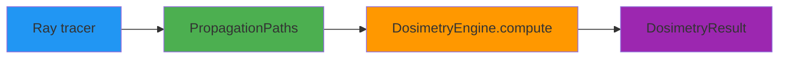

<div align="center">

# AEGIS

### Adaptive Electromagnetic Geometric Illumination & Safety

**GPU-accelerated geometric dosimetry engine for wireless exposure assessment**

[](https://github.com/rwydaegh/aegis/actions/workflows/ci.yml)
[](https://github.com/rwydaegh/aegis/actions/workflows/deploy.yml)
[](https://github.com/rwydaegh/aegis/actions/workflows/docs.yml)
[](https://codecov.io/gh/rwydaegh/aegis)
[](https://qlty.sh/gh/rwydaegh/projects/aegis)
[](https://github.com/rwydaegh/aegis)
[](https://github.com/astral-sh/ruff)
[](https://www.python.org/)
[](LICENSE)
[](tests/)
[](https://jax.readthedocs.io/)
[](https://react.dev/)
[](https://codspeed.io/rwydaegh/aegis?utm_source=badge)

[Getting started](https://rwydaegh.github.io/aegis/getting_started/) | [Documentation](https://rwydaegh.github.io/aegis/) | [3D Viewer](https://rwydaegh.github.io/aegis/user_guide/viewer/)

</div>

---

## What is AEGIS?

AEGIS computes absorbed power density on human body surfaces in wireless environments. It replaces volumetric EM simulation (10<sup>12</sup> voxels in FDTD) with O(MN) surface operations by exploiting the fact that at mmWave frequencies, the skin depth is so shallow (< 0.5 mm) that absorption is entirely a surface phenomenon.

The core equation:

```
S_ab(r) = S_inc * T_0 * ReLU[n_hat(r) . (-k_hat)]
```

Nine fidelity levels (0-8) provide a controlled accuracy-cost tradeoff, from O(1) worst-case bounds to exposure-constrained MIMO beamforming. The geometric computation matches the full Fresnel solution to within 0.35%.

**Built for**: Researchers in dosimetry and wireless exposure, compliance engineers evaluating ICNIRP 2020 limits, and antenna designers optimizing MIMO precoders under safety constraints.

### Why AEGIS?

<table>
<tr>
<td width="50%">

**Multi-fidelity by design** - Nine levels let you trade off accuracy against compute cost. Pick the right level for your analysis, from O(1) screening to full coherent MIMO.

**Physics-validated** - Every fidelity level is validated against Mie theory, monograph derivations, and the IT'IS tissue database. Hundreds of pytest cases (run `python -m pytest tests/ --collect-only -q` for the current count), including golden tests for monograph tables.

**Surface-based computation** - Treats the body as a triangle mesh. No volumetric grid, no FDTD overhead. The key insight that makes geometric dosimetry practical.

</td>
<td width="50%">

**Coherent MIMO support** - Levels 7-8 handle complex field summation and exposure-constrained beamforming (ECBF) with a QCQP solver. Evaluate real antenna arrays, not just plane waves.

**Interactive 3D viewer** - React + Three.js frontend with a Flask REST backend. Config-driven scenes, body mesh heatmaps, voxel environments, follow camera, and real-time dosimetry visualization with jet colormap (linear/dB).

**Differentiable** - JAX backend with NumPy fallback. `jax.grad` flows through all incoherent levels and the coherent forward path. Optimize antenna placement or beamforming precoders with gradient descent.

</td>
</tr>
</table>

## Quick start

```bash
pip install -e ".[dev]"
```

```python
from aegis import DosimetryEngine, BodyMesh, TissueModel, PropagationPaths

skin = TissueModel.from_database("Skin")
body = BodyMesh.load("thelonious.stl")
paths = PropagationPaths.from_powers(k_hat=[[0, 0, -1]], power=[1.0])

engine = DosimetryEngine(skin, frequency=28e9)
result = engine.compute(body, paths, level=2)

print(f"P_abs = {result.p_abs:.4f} W")
print(f"Peak S_ab = {result.peak_sab:.2f} W/m2")
```

For coherent MIMO with exposure-constrained beamforming:

```python
from aegis import Precoder

precoder = Precoder.mrt(channel_matrix)
result = engine.compute(body, paths, level=8, precoder=precoder)

print(f"ICNIRP compliant: {result.is_compliant}")
```

Launch the 3D viewer:

```bash
python -m aegis.viewer --location "Ghent, Belgium"
python -m aegis.viewer --config configs/default.json
python -m aegis.viewer --scenario open_ground
```

---

## Fidelity levels

| Level | Name | What it adds | Cost |
|-------|------|-------------|------|
| 0 | Bound | Worst-case P_abs | O(1) |
| 1 | Aggregate | SH-compressed directivity | O(L^2) |
| 2 | Geometric | ReLU kernel on mesh | O(MN) |
| 3 | Fresnel | Angle-dependent T(theta) | O(MN) |
| 4 | Polarisation | TE/TM decomposition | O(MN) |
| 5 | Curvature | Local curvature correction | O(MN) |
| 6 | Diffraction | GELU shadow smoothing | O(MN) |
| 7 | Coherent | Complex field summation | O(MNK) |
| 8 | ECBF | Exposure-constrained beamforming | O(K^3) |

Levels 0-6 use scalar power per path (incoherent). Levels 7-8 use complex amplitudes and MIMO antenna structure (coherent).

---

## How it works



1. **Ray tracer** produces propagation paths (directions k_hat, powers, or complex amplitudes psi)
2. **PropagationPaths** wraps the ray data with `.from_powers()` for incoherent or full complex fields for coherent
3. **DosimetryEngine** dispatches to the appropriate fidelity kernel (levels 0-8)
4. **DosimetryResult** contains absorbed power density S_ab, total absorbed power P_abs, whole-body SAR, and ICNIRP compliance

The engine accepts any triangle mesh as a body model and any tissue model from the IT'IS v5.0 database or custom Cole-Cole parameters.

---

## Architecture

```
src/aegis/
    engine.py          Main entry point, dispatches to kernel by level
    paths.py           PropagationPaths (k_hat, psi, element_index)
    result.py          DosimetryResult (sab, p_abs, sar_wb, Q, rho)
    precoder.py        Precoder for MIMO beamforming vector x
    tissue/            EM properties, Cole-Cole model, Fresnel coefficients
    geometry/          Body mesh, ambient occlusion, directivity, spatial averaging
    kernels/           Fidelity levels 0-8, one file per level
    coherent/          Field channel, exposure operator Q, ECBF solver
    optim.py           Differentiable loss functions for jax.grad
    compliance/        ICNIRP 2020 limits
    integration/       DiffeRT ray tracer bridge
    viewer/            Flask REST backend (compute, data, config APIs)
    viz/               Matplotlib/Plotly dashboards
aegis-web/             React + Three.js frontend (Vite, R3F, Zustand)
```

---

## Installation

### From source (recommended)

```bash
git clone https://github.com/rwydaegh/aegis.git
cd aegis
git lfs install
git lfs pull
pip install -e ".[dev]"
```

If `git-lfs` is not installed yet, install it before `git lfs pull`. The deploy and full-test workflows already check out with `lfs: true`, and the Docker image copies `data/` into the backend image, so local clones need the same data present if you want parity with deploys.

### Optional extras

```bash
pip install -e ".[viz]"      # matplotlib, plotly, pyvista dashboards
pip install -e ".[rt]"       # DiffeRT ray tracer integration
pip install -e ".[gpu]"      # JAX with CUDA support
pip install -e ".[docs]"     # MkDocs documentation site
pip install -e ".[all]"      # everything
```

### Requirements

- Python 3.11+
- NumPy >= 1.24, SciPy >= 1.10
- Data assets under `data/` (set `AEGIS_DATA_DIR` if you keep them elsewhere)

The animated phantom viewer assets live in `data/phantoms/`. The committed runtime payload is the `.glb` outputs plus preview renders. Large FBX build inputs are intentionally kept local.

---

## Testing

```bash
pytest tests/ -m "not slow" -x
pytest tests/
pytest tests/ --collect-only -q
pytest tests/ --cov=aegis
```

The suite includes golden tests against monograph tables, Mie regression as the CI canary, Hypothesis property tests, engine and coherent pipeline tests, Flask viewer routes, and visualization smoke tests. See [docs/developer_guide/testing.md](docs/developer_guide/testing.md) for defaults (`-n 2` workers), CI, and coverage omissions.

---

## Documentation

| Resource | Description |
|----------|-------------|
| [Getting started](https://rwydaegh.github.io/aegis/getting_started/) | Install and run your first computation |
| [User guide](https://rwydaegh.github.io/aegis/user_guide/overview/) | Fidelity levels, tissue models, geometry, coherent MIMO, optimization |
| [Interactive viewer](https://rwydaegh.github.io/aegis/user_guide/viewer/) | 3D visualization with config-driven scenes |
| [Developer guide](https://rwydaegh.github.io/aegis/developer_guide/architecture/) | Architecture, data flow, testing strategy |
| [API reference](https://rwydaegh.github.io/aegis/reference/api/) | Auto-generated class and function docs |

Build the docs locally:

```bash
pip install -e ".[docs]"
mkdocs serve
```

---

## Contributing

1. Fork the repo and create a feature branch
2. Follow code style (Ruff, type annotations on public API)
3. Add tests for new features. Never weaken assertions to make tests pass.
4. Submit a PR with a clear description

```bash
ruff check src/ tests/
ruff format src/ tests/
pytest tests/ -m "not slow"
```

---

## Citing

```bibtex
@software{Wydaeghe_AEGIS,
  title   = {{AEGIS: Adaptive Electromagnetic Geometric Illumination \& Safety}},
  author  = {Wydaeghe, Robin},
  url     = {https://github.com/rwydaegh/aegis},
  license = {Apache-2.0},
  version = {0.17.0}
}
```

## License

Apache-2.0. See [LICENSE](LICENSE) for details.

---

<div align="center">

[Documentation](https://rwydaegh.github.io/aegis/) | [Report an issue](https://github.com/rwydaegh/aegis/issues) | [Releases](https://github.com/rwydaegh/aegis/releases)

</div>
