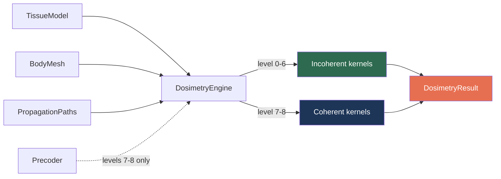
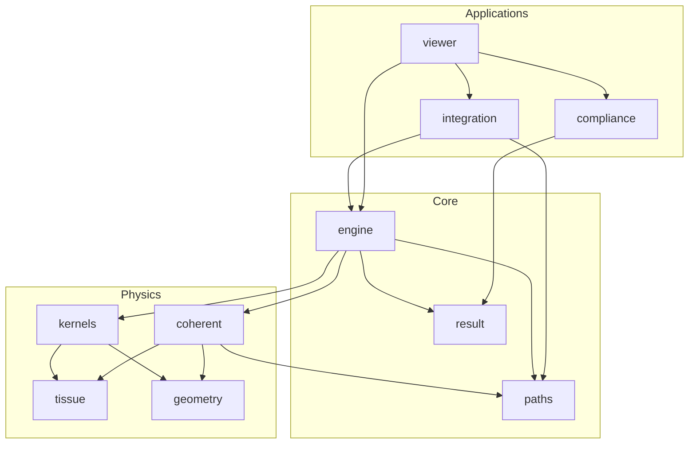

# Architecture

## Module structure

```
src/aegis/
    __init__.py           Package root, top-level API exports
    _array_backend.py     JAX/NumPy backend switcher (xp, jit, erf)
    constants.py          Physical constants (c_0, eps_0, mu_0, Z_0)
    config.py             SimulationConfig for batch runner YAML
    paths.py              PropagationPaths dataclass (directions + amplitudes)
    result.py             DosimetryResult dataclass (S_ab, P_abs, SAR, Q, rho)
    engine.py             DosimetryEngine: level dispatch 0-8
    precoder.py           Precoder dataclass (MRT, ECBF constructors)
    run.py                Batch runner CLI entry point
    tissue/               Tissue electromagnetic properties
        fresnel.py        Fresnel power + amplitude transmission (T_s, T_p, t_s, t_p, T_0)
        cole_cole.py      4-pole Cole-Cole permittivity model
        database.py       IT'IS v5.0 SQLite loader
        dielectric.py     TissueModel dataclass
    geometry/             Body mesh and spatial operations
        mesh.py           BodyMesh dataclass, STL loading, triangle areas
        occlusion.py      BVH-accelerated cosine-weighted ambient occlusion
        projected_area.py A_perp LUT, Fibonacci sphere sampling
        directivity.py    D(k_hat), SH fit/eval, reconstruction error
        cauchy.py         Cauchy formula, mean projected area
        averaging.py      ICNIRP 4 cm^2 spatial averaging via KD-tree
    kernels/              Fidelity levels 0-8
        _base.py              Shared helpers (incidence_geometry, fresnel_weights)
        level0_bound.py       O(1) worst-case power bound
        level1_aggregate.py   O(N) aggregate via SH directivity
        level2_geometric.py   O(MN) core ReLU map with constant T_0
        level3_fresnel.py     O(MN) angle-dependent T_avg(theta)
        level4_polarisation.py  + q * DeltaT/2 polarisation correction
        level5_curvature.py   + H/k * ReLU^2 curvature correction
        level6_diffraction.py   ReLU -> physical GELU
        level7_coherent.py    S_ab = ||G_tilde(r) x||^2
        level8_ecbf.py        + ECBF QCQP solver
    coherent/             Coherent MIMO dosimetry (levels 7-8)
        fresnel_operator.py   TE/TM basis, F_n rank-2 operator
        field_channel.py      G(r) field channel matrix from paths
        body_channel.py       G_tilde(r) with Fresnel filtering + depth coupling
        exposure_operator.py  Q matrix, eigendecomposition, rho
        ecbf.py               QCQP solver via bisection in Q eigenbasis
    compliance/           ICNIRP 2020 limits and compliance checks
    integration/          Ray tracer bridges
        differt.py        DiffeRT ray tracer bridge
        sionna.py         Sionna RT ray tracer bridge
    viewer/               Flask REST backend (compute, data, config APIs)
        server.py         Flask app factory
        config.py         Viewer config defaults and loading
        compute.py        Dosimetry compute wrappers for viewer
        scene_data.py     Body/voxel serialization (Z-up to Y-up)
        pipeline.py       Viewer pipeline
        raytracer.py      Viewer ray tracer helpers
        routes/           Flask route blueprints (compute, data, location)
    viz/                  Visualization
        heatmap.py        S_ab heatmaps (plotly/matplotlib)
        dashboard.py      Multi-panel compliance dashboard
        comparison.py     Side-by-side level comparison
        frequency_plots.py  Tissue spectrum and frequency sweeps
aegis-web/                    React + Three.js frontend (Vite, R3F, Zustand)
    src/components/           Scene, panels, layout, HUD overlay
    src/stores/               Zustand state (simulation, scene, UI)
    src/hooks/                Data fetching, keyboard, body loading
    src/api/                  REST client for Flask backend
    src/lib/                  Colormap, physics simulation, formatting
```

## Data flow



Levels 0-6 are incoherent: they use `paths.power` (scalar per path). Levels 7-8 are coherent: they use `paths.psi` (complex vector per path) and a `Precoder` with precoding vector `x`.

## Module dependencies



The `Core` group holds the engine entry point, path abstraction, and result container. `Physics` contains tissue properties, mesh geometry, and the fidelity kernels. `Applications` are consumer-facing: ICNIRP compliance checks, ray tracer bridges, and the interactive viewer.

## Viewer architecture

The viewer is a full-stack web application split between a Flask REST backend and a React + Three.js frontend.

### Backend (Flask)

The Flask app is created in `src/aegis/viewer/server.py` via `create_app()`. Routes are organized in separate modules under `src/aegis/viewer/routes/`, each exposing a `register(app, cache, cache_lock)` function that attaches endpoints to the app. Route modules:

- `compute.py` handles `POST /api/compute`, plus ray-traced variants (`/api/compute/rt`, `/api/compute/voxel-rt`, `/api/compute/sionna-rt`). Each endpoint parses the request, runs `DosimetryEngine.compute()`, and returns binary S_ab arrays with JSON stats.
- `data.py` serves body meshes (`GET /api/body`), voxels (`GET /api/voxels`), and config (`GET /api/config`).
- `environment.py` handles OSM fetching, 3D Tiles proxy, and scene export for ray tracing.
- `location.py` provides SSE-based geocoded location loading (`GET /api/location/load`).
- `analysis.py` serves compliance limits, tissue spectra, and power/frequency sweep data.
- `mimo.py` handles coherent MIMO compute and result retrieval.
- `basestations.py` loads real base station antenna data.

Supporting modules: `compute.py` wraps dosimetry calls, `scene_data.py` serializes meshes to binary (swapping Z-up to Y-up), `pipeline.py` manages the compute pipeline, `config.py` defines DEFAULTS and deep-merge logic.

### Frontend (React + R3F + Zustand)

The frontend lives in `aegis-web/` and uses Vite for bundling. Key directories:

- `src/components/scene/` contains React Three Fiber components: `SceneRoot.tsx` (canvas and camera setup), `BodyMesh.tsx` (phantom with colormap), `Antenna.tsx` (radiation pattern visualization), `Environment.tsx` / `EnvironmentOSM.tsx` / `Environment3DTiles.tsx` (city geometry), `VoxelField.tsx`, `RayPaths.tsx`, and `DistanceLine.tsx`.
- `src/components/hud/` renders the overlay on top of the 3D scene: `StatusBar.tsx` (dosimetry stats), `ColorLegend.tsx` (jet colormap with dB/linear toggle), `CompliancePanel.tsx`, `ServerInfoBadge.tsx` (CPU/RAM), and `MIMOPanel.tsx`.
- `src/components/panels/` holds sidebar control panels. Each panel maps to a domain: `PhantomPanel.tsx` (body selection, WASD movement), `ParametersPanel.tsx` (fidelity level, power, frequency), `StochasticPanel.tsx` (3GPP channel model), `RayTracingPanel.tsx`, `EnvironmentPanel.tsx` (OSM/3D Tiles), `LayersPanel.tsx` (visibility toggles), `TissuePanel.tsx`, `AntennaPanel.tsx`, and `AnalysisPanel.tsx`.
- `src/stores/` holds Zustand state. The main stores are `simulation.ts` (antenna position, dosimetry parameters, S_ab results, compliance), `scene.ts` (body name, viewer config, capabilities, path source), and `ui.ts` (sidebar state, camera mode, display options). Stores are plain objects with actions, consumed via `useShallow` selectors to avoid unnecessary re-renders.
- `src/hooks/` contains React hooks that wire stores to side effects. `useDosimetry.ts` watches simulation parameters and triggers `POST /api/compute` when inputs change, writing results back to the simulation store. `useClickToPlace.ts` handles antenna placement on click. `useBodyLoader.ts` fetches binary mesh data. `useKeyboard.ts` binds WASD/QE keys for phantom control.
- `src/api/client.ts` provides typed fetch wrappers for all Flask endpoints. Binary responses (body mesh, S_ab arrays) are decoded via `src/api/binary.ts`. Coordinate conversions between Y-up (Three.js) and Z-up (Python) happen in `src/api/coordinates.ts`.

### Dev workflow

Run the Flask backend and Vite dev server in parallel. The Vite config proxies `/api` requests to `http://localhost:5000`, so both servers must be running. Frontend changes hot-reload instantly. For production, `npm run build:copy` compiles the React app into `src/aegis/viewer/static/`, which Flask serves as static files.

### Coordinate convention

Python uses Z-up throughout (meshes, ray tracing, dosimetry). Three.js uses Y-up. The swap happens in two places: `src/aegis/viewer/scene_data.py` swaps axes when serializing body and voxel data for the frontend, and `aegis-web/src/api/coordinates.ts` swaps back when sending positions (antenna placement, body offset) to Python.

## Tissue module

Four layers:

1. `fresnel.py` computes Fresnel reflection/transmission from a complex refractive index. Power coefficients (`fresnel_transmission`) for incoherent levels, amplitude coefficients (`fresnel_amplitude`) for coherent levels. Also provides `xi_from_mu()` for the normal wave-vector component in tissue.

2. `cole_cole.py` computes complex permittivity from the 14-parameter Gabriel model.

3. `database.py` reads Gabriel parameters from the IT'IS v5.0 SQLite database.

4. `dielectric.py` wraps everything into a `TissueModel` dataclass. Two construction paths: `from_params()` for hardcoded values, `from_database()` for Cole-Cole.

## Geometry module

Six components, all operating on numpy arrays:

1. `mesh.py` loads binary STL files into a frozen `BodyMesh` dataclass. Stores vertices (N,3,3), normals (N,3), centroids (N,3), and areas (N,).
2. `occlusion.py` computes exposure fraction eta via BVH-accelerated cosine-weighted ray tracing.
3. `projected_area.py` computes A_perp(k_hat) for a set of directions.
4. `directivity.py` computes D(k_hat) and fits spherical harmonics.
5. `cauchy.py` implements the Cauchy surface area formula.
6. `averaging.py` applies ICNIRP 4 cm^2 spatial averaging using a KD-tree.

## Incoherent kernels (levels 0-6)

Each kernel is a pure function in its own file, imported lazily. The kernel signature pattern:

```python
def levelN_something(
    normals: ndarray,    # (M, 3) triangle normals
    k_hat: ndarray,      # (N, 3) incident directions
    power: ndarray,      # (N,) per-path power [W/m^2]
    T0: float,           # normal-incidence transmission
    ...                  # level-specific params
) -> ndarray:            # (M,) per-triangle S_ab [W/m^2]
```

Higher levels call or extend lower levels. No code duplication between kernels.

## Coherent module (levels 7-8)

The coherent pipeline builds the body-surface channel G_tilde(r) from propagation paths and tissue properties, then computes S_ab = ||G_tilde(r) x||^2.

Five components:

1. `fresnel_operator.py` computes TE/TM basis vectors for each (triangle, path) pair and builds the rank-2 Fresnel transmission operator F_n(r). Uses Approximation 1 (TM direction, error <= 4%).

2. `field_channel.py` builds the field channel G(r) from path amplitudes and phases. Not used directly for dosimetry but available for incident field analysis.

3. `body_channel.py` builds G_tilde(r) by applying Fresnel filtering (F_n) and depth coupling (sqrt(sigma/4alpha)) to each path contribution. Uses Approximation 2 (universal depth coupling, error <= 0.44%). Accumulates by antenna element to produce a (M_tri, 3, M_ant) complex matrix.

4. `exposure_operator.py` integrates G_tilde^H @ G_tilde over the body surface to produce the Hermitian PSD exposure operator Q. Also provides eigendecomposition and the exposure-signal alignment metric rho.

5. `ecbf.py` solves the QCQP for exposure-constrained beamforming. Works in the Q eigenbasis, finding the optimal Lagrange multiplier via bisection.

## PropagationPaths

The critical abstraction bridging ray tracers and dosimetry. Stores N paths with:

- `k_hat` (N,3): arrival directions
- `psi` (N,3): complex polarisation-amplitude vectors
- `element_index` (N,): antenna element assignment
- `delay` (N,): propagation delay [s]
- `is_los` (N,): line-of-sight boolean flags
- `power` (N,): computed property, derived from |psi|^2 / (2*Z_0)

The `from_powers()` constructor creates paths from scalar powers (for incoherent use). Two integration functions convert ray tracer output: `paths_from_differt()` and `paths_from_sionna_scene()` in `aegis.integration`.

## DosimetryResult

The same output type for every fidelity level:

- `sab` (M,): per-triangle S_ab [W/m^2]
- `p_abs`: total absorbed power [W]
- `fidelity_level`: which kernel produced the result
- `sab_averaged` (M,): 4 cm^2 averaged (optional)
- `sar_wb`: whole-body SAR (optional, needs body_mass)
- `Q` (M_ant, M_ant): exposure operator (levels 7-8 only)
- `eigenvalues` (M_ant,): Q eigenvalues (levels 7-8 only)
- `rho`: exposure-signal alignment (levels 7-8 only)
- `x_star` (M_ant,): optimal precoder from ECBF (level 8 only)

Computed properties: `peak_sab`, `mean_sab`, `peak_triangle_index`, `peak_sab_averaged`, `compliant_sab`, `compliant_sar`. Serialization: `to_dict()`, `to_json()`.

## Precoder

Wraps the complex precoding vector x with constructors:

- `Precoder.mrt(h, P)`: maximum ratio transmission (x = sqrt(P) * h* / ||h||)
- `Precoder.ecbf(h, Q, P_abs_max, P)`: exposure-constrained beamforming

## Design principles

- NumPy + SciPy core, optional JAX backend via `_array_backend.py`.
- Frozen dataclasses for immutability.
- Kernels are pure functions, no classes or mutable state.
- The Mie regression test is the CI canary.
- Higher levels call or extend lower levels. No code duplication.
- Coherent modules are additive. Phases 0-3 code was not modified.
