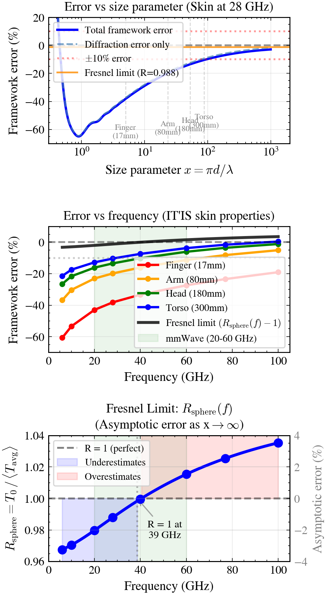

# Testing

## Test categories

Tests fall into these groups:

- Golden tests (`tests/golden/`) reproduce monograph tables through the Cole-Cole pipeline.
- Property tests (Hypothesis) check tissue and Fresnel invariants (for example T_0 in (0,1), bounded transmission).
- Regression tests compare against the Mie analytical solution. The Mie test is the CI canary.
- Engine tests run `PropagationPaths` through `DosimetryResult` on synthetic meshes for incoherent levels 0-6.
- Coherent tests cover levels 7-8 (Q matrix, ECBF, precoder).
- Viewer tests hit Flask JSON routes, auth, config, compute helpers, and voxel fixtures. The React UI is under `aegis-web/`. Full 3D interaction is left to manual QA or browser automation.
- Visualization tests build heatmaps, dashboards, and comparison plots.

`@pytest.mark.slow` marks tests that need mesh files, `itis_v5.db`, or similar. It does not label wall time. The filter `pytest -m "not slow"` still spends most time on coherent kernels, Hypothesis, optional JAX, and Plotly.

## Running tests

List what pytest will run:

```bash
python -m pytest tests/ --collect-only -q
```

Typical commands:

```bash
python -m pytest tests/ -m "not slow" -x
python -m pytest tests/
```

`pyproject.toml` sets pytest-xdist to two workers (`-n 2`). That splits work across two processes without spawning one worker per CPU. For a single process (debuggers, tight RAM), run `pytest -n 0`. Avoid `pytest -n auto` on a workstation unless you know RAM headroom.

Pre-commit runs ruff and codespell only. GitHub Actions runs `pytest tests/` with coverage on every push and PR, including slow tests. The `Full test suite (manual)` workflow is for optional manual runs with verbose output and Git LFS checkout.

## Coverage

Some paths are omitted from coverage reports where line counts mislead more than they help. See `[tool.coverage.run] omit` in `pyproject.toml` (optional Sionna bridge, viewer CLI entry, pipeline glue).

## Engine test structure

`test_engine.py` uses synthetic meshes so most tests need no external data:

- Flat plane (100 triangles, +z normals): normal incidence, grazing, backside, P_abs = T_0 * A_total.
- Icosahedron (20 triangles, near-spherical): non-negative S_ab, energy bounds, multi-path cases, level checks.

## Coherent test structure

See `tests/test_coherent.py` for the MIMO pipeline, Q, ECBF, and level 7-8 engine behaviour.

## Data dependencies

Slow tests may require:

- `golden/test_tables.py`: `itis_v5.db` under the data directory
- `test_mie.py`: `miepython` and SciPy (in `[dev]` extras)
- `test_geometry.py` (slow cases): `thelonious.stl`
- `test_engine.py::TestE2EThelonious`: `thelonious.stl`

Data ships in `data/` in the repo. Override with `AEGIS_DATA_DIR` if needed. For local parity with CI and Docker builds, install Git LFS and run `git lfs pull` after cloning so any LFS-backed assets in `data/` are present before slow tests or image builds.

## Golden test values

**Table 1 (Fresnel, skin at 28 GHz):** T_s, T_p, T_avg at 0, 30, 45, 60, 75 degrees. Tolerance: 0.002.

**Table 4 (T_0 vs frequency, IT'IS skin):** T_0 at 6, 10, 28, 40, 60, 100 GHz. Tolerance: 0.003.

**Table 5 (skin dielectric properties):** eps_r and |n| at 6, 28, 60, 100 GHz. Tolerance: 2% relative for eps_r, 0.05 absolute for |n|.

## Mie regression (the canary)

<div class="fig-portrait" markdown>

</div>
<span class="fig-caption">Framework error vs Mie analytical solution. Top: error vs size parameter. Middle: error vs frequency. Bottom: Fresnel limit $R_{\mathrm{sphere}}(f)$.</span>

The Mie test compares the framework to an independent analytical solution. It computes R_sphere = T_0 / Q_abs_GO for skin at 28 GHz and checks:

- R_sphere ~ 0.988 (framework underestimates by ~1.2%)
- R_sphere < 1.0 (conservative at 28 GHz)
- Error decreases monotonically with sphere size
- Large-sphere Q_abs converges toward the GO limit

If this test fails, the Fresnel or tissue path is wrong in a fundamental way.
