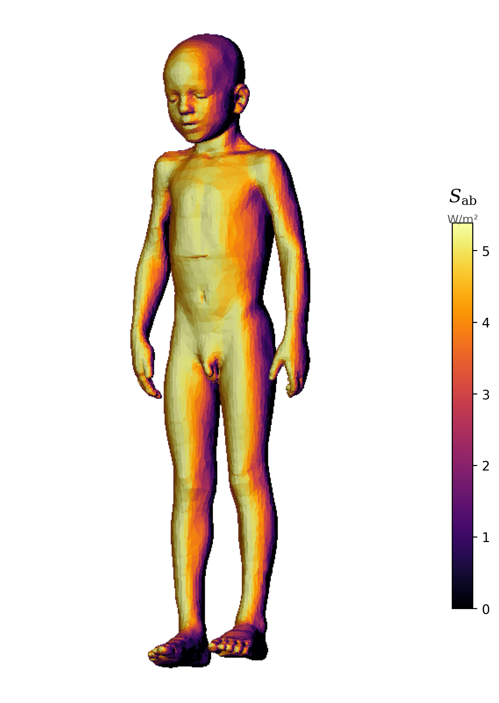

# AEGIS

**Adaptive Electromagnetic Geometric Illumination & Safety**

AEGIS computes absorbed power density on human body surfaces in wireless environments. It replaces volumetric EM simulation ($10^{12}$ voxels) with $O(MN)$ surface operations by exploiting the geometric nature of mmWave dosimetry.

The core equation:

$$S_{\mathrm{ab}}(\mathbf{r}) = S_{\mathrm{inc}} \cdot T_0 \cdot [\hat{n}(\mathbf{r}) \cdot (-\hat{k})]_+$$

Nine fidelity levels (0-8) provide a controlled accuracy-cost tradeoff, from $O(1)$ worst-case bounds to $O(M_{\mathrm{ant}}^3)$ exposure-constrained beamforming.

<div class="fig-portrait" markdown>

</div>

<div class="grid cards" markdown>

-   :material-download:{ .lg .middle } **Getting started**

    ---

    Install AEGIS and run your first dosimetry computation in under a minute.

    [:octicons-arrow-right-24: Installation](getting_started.md)

-   :material-layers-outline:{ .lg .middle } **Fidelity levels**

    ---

    Nine levels from worst-case bounds to coherent MIMO beamforming.

    [:octicons-arrow-right-24: Levels 0-8](user_guide/fidelity_levels.md)

-   :material-human:{ .lg .middle } **Tissue and geometry**

    ---

    Cole-Cole dielectric models, Fresnel transmission, and body mesh operations.

    [:octicons-arrow-right-24: User guide](user_guide/overview.md)

-   :material-code-braces:{ .lg .middle } **API reference**

    ---

    Auto-generated from source. Every public class and function documented.

    [:octicons-arrow-right-24: Reference](reference/api.md)

-   :material-cogs:{ .lg .middle } **Architecture**

    ---

    Module structure, data flow, and design principles.

    [:octicons-arrow-right-24: Developer guide](developer_guide/architecture.md)

-   :material-test-tube:{ .lg .middle } **Testing**

    ---

    Golden tests, property tests, Mie regression, and 260+ test cases.

    [:octicons-arrow-right-24: Test guide](developer_guide/testing.md)

</div>

## Quick start

```python
from aegis import DosimetryEngine, BodyMesh, TissueModel, PropagationPaths

skin = TissueModel.from_database("Skin", 28e9)
body = BodyMesh.load("thelonious.stl")
paths = PropagationPaths.from_powers(k_hat=[[0, 0, -1]], power=[1.0])

engine = DosimetryEngine(skin)
result = engine.compute(body, paths, level=2)

print(f"P_abs = {result.p_abs:.4f} W")
print(f"Peak S_ab = {result.peak_sab:.2f} W/m²")
```

## How it works

AEGIS treats the human body as a triangle mesh and incoming wireless signals as propagation paths (directions + powers). For each triangle, the kernel computes absorbed power density based on the angle between the surface normal and the incoming wave direction.

The key insight: at mmWave frequencies, the skin depth is so shallow (< 0.5 mm) that absorption is entirely a surface phenomenon. This makes the $O(MN)$ geometric computation exact to within 0.35% of the full Fresnel solution.

## Fidelity levels at a glance

| Level | Name | What it adds | Cost |
|-------|------|-------------|------|
| 0 | Bound | Worst-case $P_{\mathrm{abs}}$ | $O(1)$ |
| 1 | Aggregate | SH-compressed directivity | $O(L^2)$ |
| 2 | Geometric | ReLU kernel on mesh | $O(MN)$ |
| 3 | Fresnel | Angle-dependent $T(\theta)$ | $O(MN)$ |
| 4 | Polarisation | TE/TM decomposition | $O(MN)$ |
| 5 | Curvature | Local curvature correction | $O(MN)$ |
| 6 | Diffraction | GELU shadow smoothing | $O(MN)$ |
| 7 | Coherent | Complex field summation | $O(MNK)$ |
| 8 | ECBF | Exposure-constrained beamforming | $O(K^3)$ |

In practice, all nine levels complete in milliseconds for typical meshes. Pick the level that matches your physics requirements, not your performance budget.
