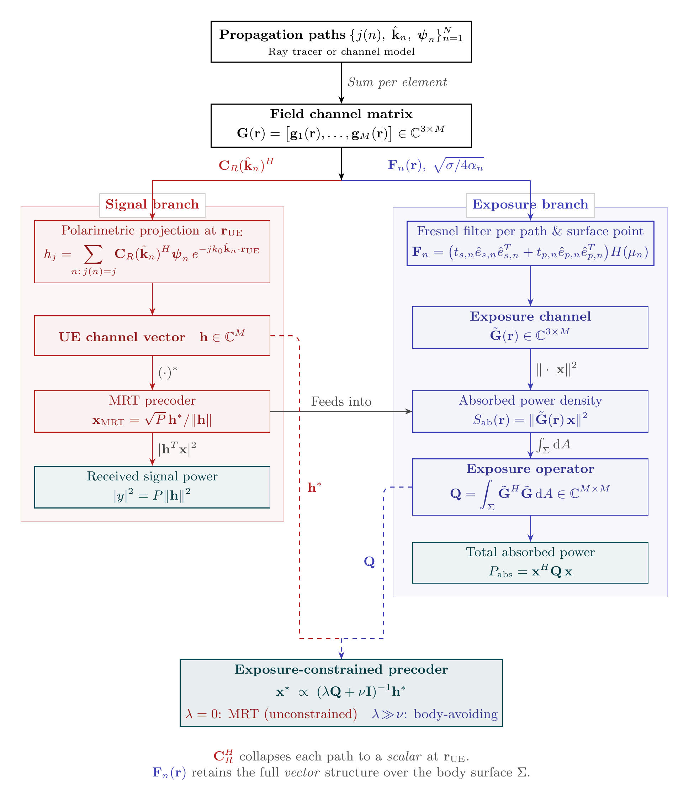

# Coherent MIMO dosimetry

For a step-by-step walkthrough with code, see the [coherent MIMO tutorial](../tutorials/coherent_mimo.md).

Levels 7 and 8 extend AEGIS to coherent multi-antenna systems. Instead of scalar power per path, these levels use complex polarization-amplitude vectors and antenna element structure to compute the interference pattern on the body surface.

<div class="fig-wide" markdown>

</div>
<span class="fig-caption">Signal branch (red) and exposure branch (blue) of the coherent MIMO pipeline.</span>

## From incoherent to coherent

Incoherent dosimetry (Levels 0-6) sums power contributions independently:

$$S_{\mathrm{ab}}(\mathbf{r}) = \sum_i T(\theta_i) \cdot [\hat{n} \cdot (-\hat{k}_i)]_+ \cdot S_i$$

Coherent dosimetry (Level 7) sums complex field contributions, then takes the squared magnitude:

$$S_{\mathrm{ab}}(\mathbf{r}) = \|\tilde{\mathbf{G}}(\mathbf{r}) \, \mathbf{x}\|^2$$

where $\tilde{\mathbf{G}}(\mathbf{r})$ is the body-surface channel matrix and $\mathbf{x}$ is the precoding vector.

The difference matters when paths from the same antenna element can interfere constructively or destructively on the body surface.

## PropagationPaths for coherent use

Coherent levels need the full `PropagationPaths` object with complex polarization-amplitude vectors `psi` and an `element_index` array mapping each path to its originating antenna element. The `psi` vectors carry both polarization direction and amplitude, with $S_i = |\boldsymbol{\psi}_i|^2 / (2 Z_0)$ giving the per-path power density. The [tutorial](../tutorials/coherent_mimo.md) shows how to construct these paths from scratch.

## The body-surface channel

The coherent pipeline builds $\tilde{\mathbf{G}}(\mathbf{r})$ in three steps:

1. **TE/TM decomposition** - For each (triangle, path) pair, compute the TE and TM basis vectors and the Fresnel transmission operator $\mathbf{F}_n(\mathbf{r})$.

2. **Depth coupling** - Apply a factor $\sqrt{\sigma / 4\alpha}$ that accounts for the exponential decay of the field into tissue.

3. **Element accumulation** - Sum path contributions by antenna element to produce a $(3 \times M_{\mathrm{ant}})$ matrix at each triangle.

Two approximations make this tractable:

- **Approximation 1** (TM direction): treats the refracted TM direction as parallel to the incidence plane projection onto the surface. Error $\leq$ 4%.
- **Approximation 2** (depth coupling): uses a universal depth coupling factor independent of incidence angle. Error $\leq$ 0.44%.

## Exposure operator Q

The exposure operator integrates the squared-norm field over the body surface:

$$\mathbf{Q} = \sum_m a_m \, \tilde{\mathbf{G}}_m^H \tilde{\mathbf{G}}_m$$

where $a_m$ is the area of triangle $m$. Key properties:

- $\mathbf{Q}$ is Hermitian and positive semi-definite
- $P_{\mathrm{abs}} = \mathbf{x}^H \mathbf{Q} \mathbf{x}$ for any precoding vector $\mathbf{x}$
- Its eigenvalues tell you the worst-case and best-case absorption for unit-power precoders

```python
# After a Level 7 computation
result = engine.compute(body, paths, level=7, precoder=precoder, h=h)

Q = result.Q                  # (M_ant, M_ant) Hermitian PSD
evals = result.eigenvalues    # descending order
print(f"Worst-case P_abs: {evals[0]:.4f} W (for unit power)")
print(f"Best-case P_abs: {evals[-1]:.6f} W")
```

## Exposure-signal alignment

The metric $\rho$ quantifies how aligned the communication channel $\mathbf{h}$ is with the exposure eigenvectors:

$$\rho = \frac{\mathbf{h}^H \mathbf{Q} \mathbf{h}}{\|\mathbf{h}\|^2 \cdot \lambda_{\mathrm{max}}}$$

$\rho = 1$ means MRT beamforming hits the worst-case exposure direction. $\rho \approx 0$ means the channel is nearly orthogonal to the dominant exposure mode, so MRT is already low-exposure.

## Precoders

The `Precoder` class wraps a complex precoding vector $\mathbf{x}$. Use `Precoder.mrt(h, P=1.0)` for maximum ratio transmission ($\mathbf{x} = \sqrt{P}\,\mathbf{h}^* / \|\mathbf{h}\|$) or `Precoder.ecbf(h, Q, P_abs_max, P)` for exposure-constrained beamforming. The [tutorial](../tutorials/coherent_mimo.md) demonstrates both precoders with worked examples.

## Level 7: coherent map

Computes $S_{\mathrm{ab}}(\mathbf{r})$, $\mathbf{Q}$, eigenvalues, and $\rho$ for a given precoder. Pass `level=7` with a `Precoder` and optionally `h` to get the exposure-signal alignment metric. See the [tutorial](../tutorials/coherent_mimo.md) for a full worked example.

### Corollary 4.1

For a single plane wave (one path, one element), Level 7 matches incoherent Level 3 within 10%. This validates the coherent pipeline against the simpler incoherent computation.

### Corollary 4.2

Averaging Level 7 over many random phase realizations converges to the incoherent result. This confirms that incoherent dosimetry is the expected value of coherent dosimetry.

## Level 8: ECBF

Level 8 solves a QCQP to find the precoder maximizing signal power subject to an absorption constraint:

$$\max_{\mathbf{x}} |\mathbf{h}^H \mathbf{x}|^2 \quad \text{s.t.} \quad \mathbf{x}^H \mathbf{Q} \mathbf{x} \le P_{\mathrm{abs}}^{\mathrm{max}}, \quad \|\mathbf{x}\|^2 \le P$$

The solver works in the Q eigenbasis and finds the optimal Lagrange multiplier via bisection. When the MRT precoder already satisfies the constraint, ECBF returns MRT (it is the unconstrained optimum). The [tutorial](../tutorials/coherent_mimo.md) compares MRT and ECBF side by side with a worked example.
