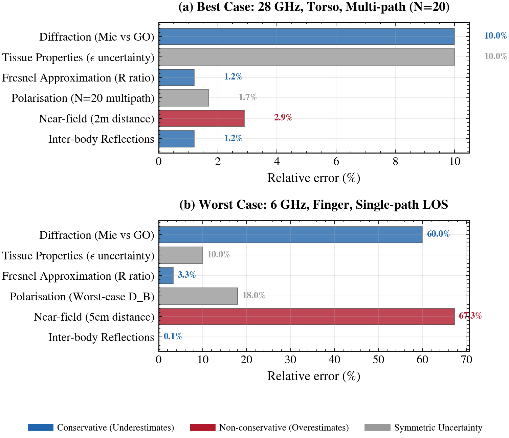

# Overview

AEGIS computes absorbed power density on human body meshes. Two APIs are available. Use `level=` (0-8) to select a predefined fidelity level by integer. Use `mode=` (`bound`, `aggregate`, `spatial`, `coherent`, `ecbf`) with optional correction flags when you need finer control over which physics are applied. Both call the same kernels. See [fidelity levels](fidelity_levels.md) for the full mapping.

## Physical model

At mmWave frequencies (above 6 GHz), the skin depth in human tissue is 0.3 to 0.5 mm. All incident power is absorbed in the outermost layer. Absorption is a surface phenomenon, not a volumetric one, which eliminates the need for full-wave simulation of the body interior.

The core equation computes absorbed power density at each point $\mathbf{r}$ on the body surface:

$$S_{\mathrm{ab}}(\mathbf{r}) = S_{\mathrm{inc}} \cdot T_0 \cdot [\hat{n}(\mathbf{r}) \cdot (-\hat{k})]_+$$

$S_{\mathrm{inc}}$ is the incident power density of the incoming wave. $T_0$ is the normal-incidence Fresnel power transmission into tissue, a single scalar that captures the material response. $\hat{n}(\mathbf{r})$ is the outward surface normal at point $\mathbf{r}$, and $\hat{k}$ is the wave propagation direction. The $[\cdot]_+$ operator (ReLU) enforces that only illuminated surface patches absorb power: triangles facing away from the wave contribute zero.

<div class="fig-wide" markdown>

</div>
<span class="fig-caption">Relative error contributions by source. Best case (28 GHz torso, multipath) vs worst case (6 GHz finger, single path).</span>

The framework rests on three assumptions. Each incoming path is a plane wave at the body (far-field). Each mesh triangle is locally flat (flat-facet approximation). The tissue beneath each triangle behaves as a semi-infinite lossy dielectric (half-space Fresnel model).

These assumptions break down in a few regimes. At near-field distances (less than a few wavelengths from the source), the plane-wave assumption fails. Below 6 GHz, skin depth grows and absorption becomes volumetric. On high-curvature regions like fingers and ears, the flat-facet approximation loses accuracy when triangle size approaches the wavelength.

The geometric framework matches the full Fresnel solution to within 0.35% for typical body geometries. AEGIS validates this against the analytical Mie sphere solution across body part sizes and frequencies. For full derivations, see the monograph in `theory/`.

## Typical workflow

1. Load a tissue model (skin properties at your frequency)
2. Load a body mesh (triangle mesh in STL format)
3. Define propagation paths (directions and powers, or full complex amplitudes from a ray tracer)
4. Run the engine with your chosen mode and corrections
5. Inspect the result (per-triangle S_ab, total P_abs, compliance status)

For coherent and ECBF modes, you also provide a precoding vector (via `Precoder.mrt()`) and optionally a UE channel vector h.

## Key outputs

- `result.sab` - per-triangle absorbed power density [W/m$^2$]
- `result.p_abs` - total absorbed power [W]
- `result.peak_sab` - maximum $S_{\mathrm{ab}}$ across all triangles
- `result.sar_wb` - whole-body SAR [W/kg] (if body mass provided)
- `result.compliant_sab` - True/False if spatial averaging was applied, None otherwise
- `result.Q` - exposure operator (coherent and ECBF modes)
- `result.eigenvalues` - Q eigenspectrum (coherent and ECBF modes)
- `result.rho` - exposure-signal alignment (coherent and ECBF modes)

See [fidelity levels](fidelity_levels.md) for details on each mode and correction.

## Comparing fidelity levels

`sweep_levels()` runs multiple fidelity levels in one call and returns a dict of results. Levels that need unavailable parameters (e.g. $A_{\mathrm{ab}}$ for level 0) are silently skipped.

```python
results = engine.sweep_levels(body, paths)
for level, r in results.items():
    print(f"Level {level}: peak = {r.peak_sab:.2f} W/m², P_abs = {r.p_abs:.4f} W")
```

To quantify the differences between results, use `DosimetryResult.compare()`:

```python
from aegis import DosimetryResult

comparison = DosimetryResult.compare(
    {f"L{k}": v for k, v in results.items()}
)
print(f"Relative errors: {comparison['relative_error']}")
```

This returns peak $S_{\mathrm{ab}}$, $P_{\mathrm{abs}}$, pairwise RMSE, max absolute error, and relative error across all pairs.

## Scaling and compliance shortcuts

`DosimetryResult.scale(factor)` returns a new result with all power quantities scaled. Combined with `evaluate_compliance()`, this lets you sweep transmit power without rerunning the engine:

```python
result = engine.compute(body, paths, mode="spatial")

# Scale to 2 W and check compliance
scaled = result.scale(2.0)
compliance = scaled.evaluate_compliance()
print(f"Compliant at 2 W: {compliance.overall_pass}")
```

See [compliance](compliance.md) for the full compliance workflow including `max_compliant_power()`.

## Serialization

Both `PropagationPaths` and `DosimetryResult` support round-trip serialization:

```python
# Save
d = result.to_dict()
s = result.to_json(indent=2)

# Load
result2 = DosimetryResult.from_dict(d)
result3 = DosimetryResult.from_json(s)
```

`PropagationPaths` has the same `to_dict()` / `from_dict()` pattern. Complex arrays (psi, Q, eigenvalues) are serialized as `{"real": [...], "imag": [...]}`.
