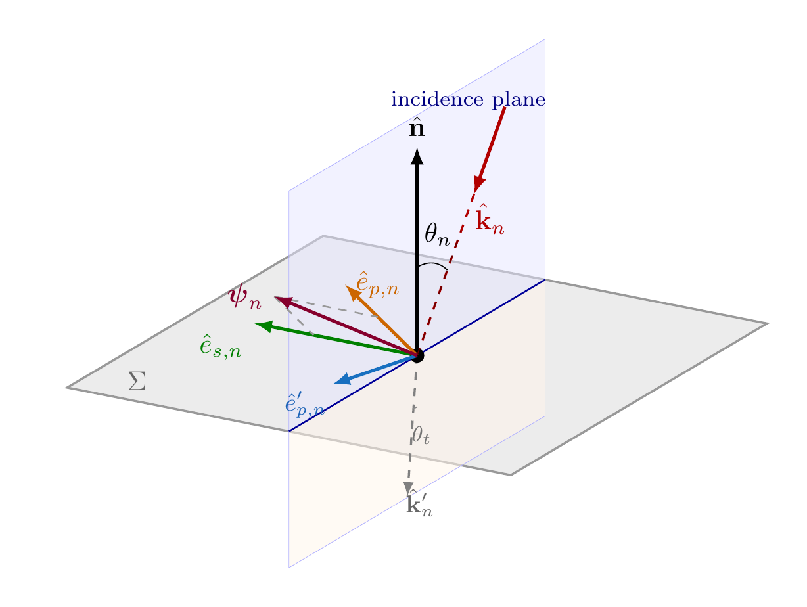

# Tissue and Fresnel transmission

For a step-by-step walkthrough with plots, see the [tissue and Fresnel tutorial](../tutorials/tissue_and_fresnel.md).

AEGIS models the electromagnetic properties of human tissue to compute how much incident power is absorbed at the body surface. The tissue module provides dielectric models, Fresnel transmission coefficients, and a database of tissue properties from the IT'IS foundation.

## Dielectric properties

At mmWave frequencies, tissue behaves as a lossy dielectric characterized by two parameters: relative permittivity $\varepsilon_r$ and conductivity $\sigma$. These combine into a complex refractive index:

$$\tilde{n} = \sqrt{\varepsilon_r - j\frac{\sigma}{\omega \varepsilon_0}}$$

For skin at 28 GHz: $\varepsilon_r = 17.0$, $\sigma = 25.0$ S/m, giving $|\tilde{n}| \approx 4.84$.

## TissueModel

The `TissueModel` dataclass wraps dielectric parameters and provides derived quantities. Create one with `TissueModel.from_params()` or use the predefined constants. The [tutorial](../tutorials/tissue_and_fresnel.md) covers creation and usage in detail.

### Predefined tissues

Four tissue types are hardcoded from published literature:

| Tissue | Frequency | $\varepsilon_r$ | $\sigma$ (S/m) | $T_0$ |
|--------|-----------|-----------------|-----------------|------------------|
| `SKIN_28GHZ` | 28 GHz | 17.0 | 25.0 | 0.539 |
| `SKIN_60GHZ` | 60 GHz | 7.9 | 36.4 | 0.623 |
| `MUSCLE_28GHZ` | 28 GHz | 25.0 | 30.0 | 0.493 |
| `FAT_28GHZ` | 28 GHz | 4.0 | 2.0 | 0.876 |

### IT'IS database

For arbitrary tissue types and frequencies, AEGIS uses the IT'IS v5.0 database with a 4-pole Cole-Cole model (Gabriel 1996). Call `TissueModel.from_database("Skin", 28e9)` with any tissue name from the IT'IS database. The database file (`itis_v5.db`) ships in `data/` inside the repo. Override with `AEGIS_DATA_DIR` if needed.

The Cole-Cole model computes complex permittivity from 14 parameters (4 poles with relaxation times spanning picoseconds to milliseconds). This gives accurate dielectric properties across 10 Hz to 100 GHz.

## Fresnel transmission

The fraction of incident power that enters the tissue depends on the angle of incidence $\theta_i$. AEGIS computes Fresnel power transmission coefficients for both TE and TM polarizations.

Incidence plane geometry showing surface normal $\hat{n}$, wave vector $\hat{k}$, and TE/TM polarization basis vectors.

### Normal incidence

At normal incidence ($\theta_i = 0$), the transmission coefficient simplifies to:

$$T_0 = \frac{4 \, \text{Re}(\tilde{n})}{|1 + \tilde{n}|^2}$$

This is the single most important tissue parameter. For skin at 28 GHz, $T_0 = 0.539$, meaning 53.9% of incident power is absorbed.

### Angle-dependent transmission

Power transmittance and amplitude coefficients for skin at 28 GHz.

For oblique incidence, TE and TM polarizations transmit different fractions. `fresnel_transmission(mu, n_tilde)` returns both $T_s$ (TE) and $T_p$ (TM) power transmission coefficients. TM polarization always transmits more than TE at oblique angles, which matters at Level 4 and above where polarization corrections are applied. The [tutorial](../tutorials/tissue_and_fresnel.md) plots the full angular dependence and demonstrates the pseudo-Brewster compensation effect.

The unpolarized (average) transmission is:

$$T_{\mathrm{avg}}(\theta) = \frac{T_s(\theta) + T_p(\theta)}{2}$$

### Amplitude coefficients

Coherent dosimetry (Levels 7-8) needs complex amplitude transmission coefficients, not power. Use `fresnel_amplitude(mu, n)` for this. The power coefficient relates to the amplitude as $T = \text{Re}(\xi) / \mu \cdot |t|^2$ where $\xi$ is the normal wave-vector component in tissue.

## How fidelity levels use tissue

| Level | Tissue parameter | Notes |
|-------|-----------------|-------|
| 0-2 | $T_0$ (scalar) | Same transmission for all angles |
| 3 | $T_{\mathrm{avg}}(\theta)$ | Angle-dependent, unpolarized |
| 4 | $T_s, T_p$ separately | Polarization-resolved |
| 5-6 | $T_{\mathrm{avg}}(\theta)$ + curvature | Physical optics correction |
| 7-8 | $t_s, t_p$ (complex amplitudes) | Full coherent Fresnel operator |

The transition from Level 2 to Level 3 (replacing constant $T_0$ with angle-dependent $T_{\mathrm{avg}}$) changes total absorbed power by about 0.35% on typical body meshes. The correction matters more for geometries with many grazing-incidence triangles.
