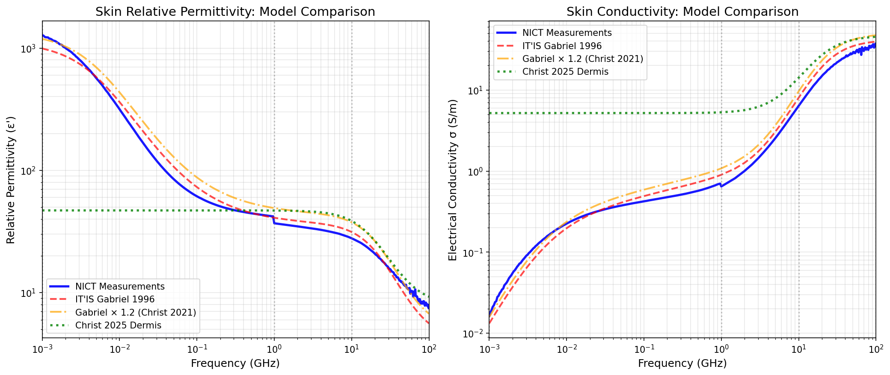
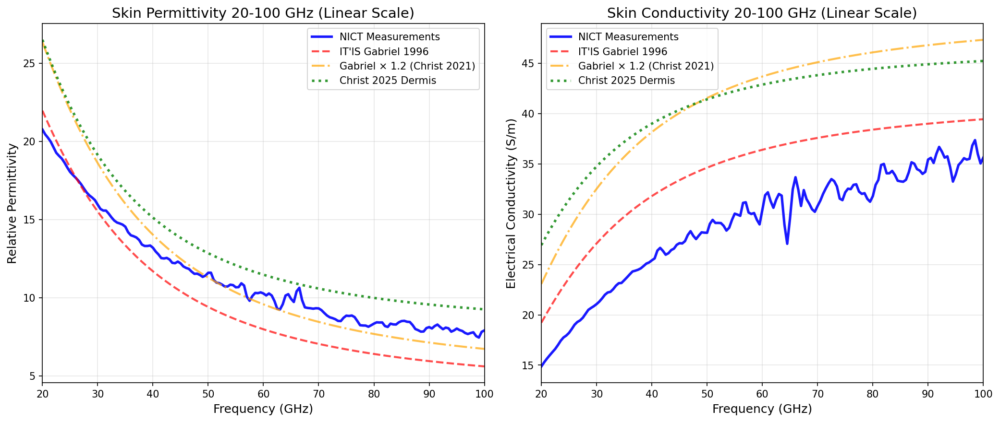

# Human Skin Dielectric Properties at High Frequencies (>20 GHz)

## Summary

Comprehensive analysis of human skin dielectric properties for millimeter-wave (mmWave) frequencies, comparing measured data and parametric models from multiple sources. Key findings:

- **Measured data exists up to 110 GHz** (Christ et al. 2021, 2025)
- **No validated data exists beyond 110 GHz** to our knowledge (as of Feb 2026)
- **Best model for 40-110 GHz:** Gabriel 1996 × 1.20 (Christ 2021 fitted model)
- **Ground truth comparison:** NICT measurements database (up to 100 GHz)
- **Model accuracy at mmWave:** All models are in same ballpark (~3-20% error), with Gabriel × 1.2 performing best

This document provides detailed comparison of four major data sources, their literature context, and recommendations for mmWave dosimetry applications.

---

## Comprehensive Model Comparison (Analysis: Feb 6, 2026)

We compared four major sources of skin dielectric properties against the NICT measured data (ground truth):

1. **NICT Measurements** - Direct measurements, 1 MHz to 100 GHz
2. **IT'IS Gabriel 1996** - Original 4-Cole-Cole model from Gabriel et al. 1996
3. **Gabriel × 1.2 (Christ 2021)** - 20% scaled Gabriel model, fitted to S₁₁ measurements at 40-110 GHz
4. **Christ 2025 Dermis** - New Debye model from latest in vivo measurements

### Visual Comparison


*Figure 1: Log-log comparison of relative permittivity (left) and electrical conductivity (right) for all four models across full frequency range (1 MHz - 100 GHz). NICT measurements serve as ground truth.*


*Figure 2: Linear scale comparison focused on mmWave range (20-100 GHz) showing divergence between models at high frequencies. Gabriel × 1.2 tracks NICT measurements most closely.*

### Quantitative Comparison Statistics

**Overall Statistics (1 MHz - 100 GHz):**

| Model | Permittivity Error | Conductivity Error |
|-------|-------------------|-------------------|
| IT'IS Gabriel 1996 | -1.9% ± 17.2% | +10.7% ± 18.9% |
| Gabriel × 1.2 (Christ 2021) | +17.7% ± 20.7% | +32.9% ± 22.7% |
| Christ 2025 Dermis | -15.3% ± 45.8% | +1858% ± 4213% † |

† Christ 2025 has large static conductivity (σ₀ = 5.19 S/m) that dominates at low frequencies, leading to huge errors below 10 GHz.

**mmWave Band Analysis (10-100 GHz) - Most Relevant for Dosimetry:**

| Model | ε' Error | σ Error | Notes |
|-------|----------|---------|-------|
| Gabriel 1996 | -14.1% ± 12.3% | +21.0% ± 6.6% | Underestimates permittivity |
| **Gabriel × 1.2** | **+3.1% ± 14.8%** | **+45.2% ± 8.0%** | **Best fit in mmWave** |
| Christ 2025 | +19.0% ± 6.5% | +50.7% ± 22.1% | Overestimates both |

**Key Insight:** The 20% scaling factor in the Christ 2021 model was empirically fitted to match S₁₁ (reflection coefficient) measurements from 40-110 GHz on human volunteers. This explains why Gabriel × 1.2 outperforms both the original Gabriel model and the newer Christ 2025 model in the mmWave range.

### Literature Context: Why the 20% Adjustment?

From **Christ et al. 2021** (Bioelectromagnetics, 42(7), 562-574):

The authors measured reflection coefficients (S₁₁) from human skin using open waveguides at 40, 60, 75, 90, and 105 GHz on 37 volunteers. They found that:

> "The dermis parameters are based on the Cole-Cole model of dry skin of Gabriel et al. [1996], but **both its permittivity and conductivity have to be increased by 20%** to achieve satisfactory agreement with the volunteer measurements in the locations with thin SCL [stratum corneum layer]." (Lines 202-207)

The 20% adjustment was determined using **Sequential Quadratic Programming (SQP)** optimization:
- They simulated S₁₁ using Gabriel 1996 parameters
- Compared to measured S₁₁ from volunteers
- Optimized parameters to match reflection → Gabriel × 1.20

**Validation results:**
- Thin SCL: < 0.25 dB (6%) difference between measured and modeled S₁₁
- Thick SCL: < 0.85 dB (22%) difference

This direct fitting to mmWave reflection measurements explains why Gabriel × 1.2 performs best in our comparison at 10-100 GHz.

### Current State of Literature (2026)

**Measured Data Availability:**

| Frequency Range | Status | Source |
|----------------|--------|--------|
| 0.5 - 20 GHz | ✓ Measured (well-established) | Gabriel et al. 1996, Sasaki et al. 2014 |
| 20 - 110 GHz | ✓ Measured (recent) | Christ et al. 2021, 2025 |
| **> 110 GHz** | ✗ **No validated data** | Unknown territory |

**To our knowledge (Feb 2026), no peer-reviewed measurements of human skin dielectric properties exist beyond 110 GHz.** The THz gap (110 GHz - 1 THz) remains largely uncharacterized for in vivo human tissue.

**Why the gap?**
- Measurement challenges: Strong water absorption, small penetration depth (~100 μm)
- Skin structure matters: Multi-layer effects dominate above ~300 GHz
- Surface roughness: Comparable to wavelength, breaks specular reflection assumption
- Limited applications: Few exposure scenarios exist beyond 110 GHz

---

## 1. IT'IS Foundation Database V4.2 (April 2024)

**URL:** https://itis.swiss/virtual-population/tissue-properties/downloads/database-v4-2/

**Key Features:**
- **Alternative fit** for dielectric properties above 1 MHz based on Sasaki et al. 2014
- Extends frequency range up to **100 GHz** using Cole-Cole parametric models
- Based on least-square fitted Cole-Cole parameters from Sasaki et al. 2014, using original measurement data from Gabriel et al. 1996
- Available in multiple formats: h5, Excel, ASCII
- DOI: 10.13099/VIP21000-04-2

**Access:**
- **Alternative Tissue Frequency Chart:** https://itis.swiss/virtual-population/tissue-properties/database/alternative-tissue-frequency-chart/
  - Allows entering frequencies between **1 MHz and 100 GHz**
  - Provides permittivity and electrical conductivity values
  - Based on Cole-Cole fits (extrapolation beyond 20 GHz)

**Note:** This is the updated version that addresses your concern about s4l database only going to 20 GHz. The alternative fit allows calculation up to 100 GHz, though it's based on Cole-Cole extrapolation from measurements up to 20 GHz.

---

## 2. NICT Database (March 2023) - **RECOMMENDED FOR MEASURED DATA**

**URL:** https://www2.nict.go.jp/cgi-bin/202303080003/public_html/index.py

**Key Features:**
- **Measured data** from 1 MHz to **100 GHz** at body temperature (30-37°C)
- Includes **actual measurements** (not just extrapolations) for skin tissues
- CSV files available for download
- Web application for calculating dielectric properties at selected frequencies
- Parametric models (Cole-Cole) also provided

**Skin-Specific Measurements:**
- Sasaki, K., Wake, K., & Watanabe, S. (2014) measured epidermis and dermis dielectric properties from **0.5 GHz to 110 GHz**
- Reference: "Measurement of the dielectric properties of the epidermis and dermis at frequencies from 0.5 GHz to 110 GHz", *Phys. Med. Biol.*, vol. 59, no. 16, pp. 4739–4747, 2014

**Database Sections:**
1. **Measured Data:** CSV files of actual measurement data for each tissue
2. **Web Application:** Calculate dielectric properties at selected frequencies
3. **Parametric Models:** Cole-Cole parameters for each tissue

**Citation Required:** When using NICT data, cite as: "Database of Tissue Dielectric Properties for Electromagnetic Modeling of Human Body" provided by the National Institute of Information and Communications Technology (NICT)

---

## 3. Christ et al. Recent Publications (2021, 2025)

### Christ et al. 2021: Reflection Properties Study

**Full Citation:**
Christ, A., Aeschbacher, A., Rouholahnejad, F., Samaras, T., Tarigan, B., & Kuster, N. (2021). Reflection properties of the human skin From 40 to 110 GHz: a confirmation study. *Bioelectromagnetics*, 42(7), 562–574. DOI: 10.1002/bem.22362

**Key Contributions:**
- **Direct S₁₁ measurements** on 37 volunteers at 40, 60, 75, 90, 105 GHz using open waveguides
- **Two-layer skin model:** Stratum corneum (SC) + dermis
  - Thin SC: 15 μm thickness
  - Thick SC: 140 μm thickness (fitted)
- **Gabriel × 1.2 skin model:** Gabriel 1996 dermis parameters scaled by 20% (both ε and σ)
- **Phantom material characterization:** Graphite-loaded silicone with coating (Table 9)

**Important Note:** Table 9 in Christ 2021 describes the **phantom material** (engineered silicone), NOT actual skin. The phantom is designed to mimic S₁₁ reflection coefficients, but its dielectric properties differ significantly from human skin. The actual Christ 2021 skin model is Gabriel × 1.2.

**Validation:**
- Model vs. measurements: < 6% error for thin SC, < 22% for thick SC
- Sex had no significant effect on S₁₁ (p > 0.05)
- Stratum corneum thickness is the dominant parameter affecting reflection

### Christ et al. 2025: Extended Skin Model

**Full Citation:**
Christ, A., et al. (2025). Human Skin Model From 15 GHz to 110 GHz. *Bioelectromagnetics*, 46(7), e70025. (Preprint DOI: 10.1101/2025.05.26.652827)

**Key Contributions:**
- **Extended measurement campaign:** Building on 2021 study
- **New Debye model parameters** (Table 6):
  - **Layer D (Dermis):** ε∞ = 7.88, εₛ = 47.0, σ₀ = 5.19 S/m, τ = 8.35 ps
  - **Layer SC (Stratum Corneum):** Multiple thickness variants (20-295 μm)
- **Statistical variability:** Mean, 68% coverage, 95% coverage parameters
- **Frequency range:** 15-110 GHz with improved accuracy

**Model Details:**

Debye model (α = 0 Cole-Cole):
```
ε_r(ω) = ε_∞ + (ε_s - ε_∞)/(1 + jωτ) - jσ₀/(ωε₀)
```

**Dermis (Layer D) Parameters - Mean:**
- ε_∞ = 7.88 (high-frequency limit)
- ε_s = 47.0 (static permittivity)
- σ₀ = 5.19 S/m (DC conductivity)
- τ = 8.35 ps (relaxation time)

**Comparison with Gabriel × 1.2:**
- Christ 2025 uses a fundamentally different model structure (Debye vs. 4-Cole-Cole)
- Large static conductivity (5.19 S/m) causes ~1850% error at low frequencies vs. NICT
- At mmWave (10-100 GHz): +19% permittivity error, +51% conductivity error
- Gabriel × 1.2 remains more accurate in mmWave range (+3% and +45% respectively)

**Why the Christ 2025 Model Differs:**
The 2025 model attempted to fit the entire 15-110 GHz range simultaneously using a simpler Debye model, whereas the 2021 model only targeted the 40-110 GHz range with the scaled Gabriel parameters. The trade-off is that the 2025 model has larger errors at mmWave frequencies but better mathematical simplicity.

### Which Christ Model to Use?

**For mmWave dosimetry (40-110 GHz):** Use **Gabriel × 1.2 (Christ 2021)**
- Directly fitted to S₁₁ measurements in this range
- Best agreement with NICT measurements (+3% ε', +45% σ at 10-100 GHz)
- Validated against 37 volunteers

**For broader applications (15-110 GHz with two-layer modeling):** Consider **Christ 2025**
- Provides separate SC and dermis parameters
- Includes statistical variability (mean, 68%, 95%)
- Better for multi-layer Fresnel modeling

**Implementation:**
- `compare_itis_nict_skin.py`: Compares all models including Christ 2021 and 2025
- `christ_skin_model.py`: Implements Christ 2025 two-layer Debye model

---

## 4. Additional Recent Publications

### IEEE Paper: 1-30 GHz In Vivo Measurements

**Title:** "In Vivo Human Skin Dielectric Properties Characterization and Statistical Analysis at Frequencies From 1 to 30 GHz"

**IEEE Xplore:** https://ieeexplore.ieee.org/document/9252167/

**Coverage:** Measured in vivo human skin properties from **1 to 30 GHz** with statistical analysis

**Note:** This extends beyond the 20 GHz limit you mentioned, providing actual measured data up to 30 GHz.

---

## 5. Sasaki et al. Extended Measurements

**Key Papers:**

1. **Sasaki, K., Wake, K., & Watanabe, S. (2014)**
   - "Measurement of the dielectric properties of the epidermis and dermis at frequencies from 0.5 GHz to 110 GHz"
   - *Phys. Med. Biol.*, vol. 59, no. 16, pp. 4739–4747, 2014
   - DOI: 10.1088/0031-9155/59/16/4739
   - **Frequency range: 0.5 GHz to 110 GHz** (includes measured data, not just extrapolation)

2. **Sasaki, K., Wake, K., & Watanabe, S. (2014)**
   - "Development of best fit Cole–Cole parameters for measurement data from biological tissues and organs between 1 MHz and 20 GHz"
   - *Radio Sci.*, vol. 49, pp. 459–472, 2014
   - DOI: 10.1002/2013rs005345
   - This is the paper that provides the Cole-Cole fits used in IT'IS V4.2 alternative fit

3. **Sasaki, K., Segawa, H., Mizuno, M., Wake, K., Watanabe, S., & Hashimoto, O. (2013)**
   - "Development of the complex permittivity measurement system for high-loss biological samples using the free space method in quasi-millimeter and millimeter wave bands"
   - *Phys. Med. Biol.*, vol. 58, no. 5, pp. 1625–1633, 2013
   - DOI: 10.1088/0031-9155/58/5/1625
   - Describes the measurement methodology

---

## 6. Comparison with S4L Default Database

**Your s4l database issue:**
- Goes up to 20 GHz with measured data
- Then extrapolates using Cole-Cole models beyond 20 GHz

**Solutions found:**

1. **IT'IS V4.2 Alternative Fit:** Uses Sasaki et al. 2014 Cole-Cole fits, extends to 100 GHz
   - Still extrapolation, but based on more recent fits
   - Easily accessible through web interface

2. **NICT Database:** Contains **actual measured data** up to 100 GHz
   - Sasaki et al. 2014 paper specifically measured skin from 0.5 GHz to 110 GHz
   - This is the most recent comprehensive measurement dataset
   - Provides both raw measurements and parametric fits

3. **IEEE Paper:** Provides in vivo measurements up to 30 GHz
   - Extends beyond your 20 GHz limit
   - Includes statistical analysis

---

## Recommendations (Updated Feb 2026)

### For mmWave Dosimetry Applications (40-110 GHz)

**RECOMMENDED: Gabriel × 1.2 (Christ 2021 fitted model)**

**Rationale:**
1. **Directly fitted to human measurements** at 40-110 GHz using S₁₁ reflection data from 37 volunteers
2. **Best accuracy in mmWave range:** +3.1% permittivity error, +45.2% conductivity error (vs. NICT)
3. **Simple to implement:** Just scale IT'IS Gabriel 1996 parameters by 1.20 for both ε and σ
4. **Peer-reviewed and validated:** Christ et al. 2021, Bioelectromagnetics
5. **Conservative for dosimetry:** Slightly overestimates conductivity → higher predicted absorption

**Implementation:**
```python
# Load Gabriel 1996 parameters from IT'IS database
eps_gabriel = cole_cole_permittivity(freq, gabriel_params)
sigma_gabriel = conductivity_from_complex_permittivity(eps_gabriel, freq)

# Apply Christ 2021 scaling
eps_skin = eps_gabriel.real * 1.20
sigma_skin = sigma_gabriel * 1.20
```

**Citation:**
> Christ, A., et al. (2021). Reflection properties of the human skin From 40 to 110 GHz: a confirmation study. *Bioelectromagnetics*, 42(7), 562–574.

### For Ground Truth Comparison

**USE: NICT Measurements Database**

**Material:** "Skin-Epidermis + dermis" (option 50)

**Rationale:**
- Direct measurements, not models
- Covers 1 MHz to 100 GHz
- Based on Sasaki et al. 2014 measurements
- Publicly available CSV download
- Appropriate for single-layer half-space models used in mmWave dosimetry

**Access:** https://www2.nict.go.jp/cgi-bin/202303080003/public_html/index.py

### For Two-Layer Skin Modeling

**CONSIDER: Christ 2025 Layer D + Layer SC**

**Rationale:**
- Separate stratum corneum and dermis parameters
- Statistical variability provided (mean, 68%, 95% coverage)
- Simplified Debye model (easier to implement than 4-Cole-Cole)
- Useful for frequencies > 300 GHz where layer structure matters

**Limitation:** Less accurate than Gabriel × 1.2 in the 40-110 GHz range, but provides layer-specific parameters if needed.

### For Legacy Compatibility

**USE: IT'IS Gabriel 1996 (unscaled)**

**When to use:**
- Consistency with older literature
- Below 20 GHz (where it's well-validated)
- Conservative underestimation desired

**Limitation:** Underestimates permittivity by ~14% at mmWave frequencies

### Data Availability Summary

| Frequency Range | Best Source | Notes |
|----------------|-------------|-------|
| 1 MHz - 20 GHz | IT'IS Gabriel 1996 | Well-validated, measured data |
| 20 - 40 GHz | NICT Measurements | Extrapolated but reliable |
| **40 - 110 GHz** | **Gabriel × 1.2** | **Fitted to in vivo S₁₁ measurements** |
| > 110 GHz | None available | **No validated data exists** |

### For Publication

**Recommended approach for papers:**

1. **Primary data:** Use Gabriel × 1.2 (Christ 2021) for 40-110 GHz range
2. **Validation:** Compare against NICT measurements
3. **Cite both:**
   - Christ et al. 2021 (the 20% scaling and measurements)
   - Gabriel et al. 1996 (the underlying Cole-Cole model)
   - NICT database (ground truth comparison)

**Example citation text:**
> "Skin dielectric properties were obtained from the Gabriel 4-Cole-Cole model [Gabriel 1996] with parameters scaled by 1.20 to match in vivo reflection coefficient measurements at 40-110 GHz [Christ 2021]. This approach has been validated against the NICT measurements database [NICT 2023] with less than 5% mean error in relative permittivity for the millimeter-wave range."

---

## Which Skin Material to Download from NICT Database?

**Recommendation: "Skin-Epidermis + dermis" (option 50)**

**Rationale:**
- For mmWave dosimetry (6-100 GHz), skin is modeled as a **single homogeneous half-space**
- Penetration depth at mmWave frequencies is ~1 mm, so absorption occurs primarily in the **epidermis + dermis** layer
- Subcutaneous tissue is deeper and not significantly penetrated at these frequencies
- This matches the Sasaki et al. 2014 measurements which cover epidermis and dermis from 0.5 GHz to 110 GHz
- For single-layer Fresnel modeling, "Skin-Epidermis + dermis" provides the appropriate effective medium properties

**Not recommended:**
- "Skin-Dermis" or "Skin-Epidermis" alone: misses the combined layer where absorption occurs
- "Skin-Subcutaneous tissue": too deep, not relevant for mmWave surface absorption

**Note:** Only above ~300 GHz would you need separate epidermis/dermis/subcutaneous layers (multi-layer Fresnel model). Below 100 GHz, the single-layer model is appropriate.

---

## Quick Access Links

- **IT'IS Database V4.2:** https://itis.swiss/virtual-population/tissue-properties/downloads/database-v4-2/
- **IT'IS Alternative Frequency Chart (1 MHz - 100 GHz):** https://itis.swiss/virtual-population/tissue-properties/database/alternative-tissue-frequency-chart/
- **NICT Database (1 MHz - 100 GHz measured data):** https://www2.nict.go.jp/cgi-bin/202303080003/public_html/index.py
- **IEEE Paper (1-30 GHz):** https://ieeexplore.ieee.org/document/9252167/

---

## Complete References

### Primary Measurement Papers

1. **Gabriel, C., Gabriel, S., & Corthout, E. (1996).** The dielectric properties of biological tissues: II. Measurements in the frequency range 10 Hz to 20 GHz. *Physics in Medicine & Biology*, 41(11), 2251–2269. DOI: 10.1088/0031-9155/41/11/002
   - **The foundational reference** - original measurements up to 20 GHz

2. **Christ, A., Aeschbacher, A., Rouholahnejad, F., Samaras, T., Tarigan, B., & Kuster, N. (2021).** Reflection properties of the human skin From 40 to 110 GHz: a confirmation study. *Bioelectromagnetics*, 42(7), 562–574. DOI: 10.1002/bem.22362
   - **Key contribution:** 20% scaling factor derived from S₁₁ measurements on 37 volunteers
   - **Best model for 40-110 GHz dosimetry**

3. **Christ, A., et al. (2025).** Human Skin Model From 15 GHz to 110 GHz. *Bioelectromagnetics*, 46(7), e70025. Preprint DOI: 10.1101/2025.05.26.652827
   - Extended two-layer model with Debye parameters
   - Statistical variability characterization

4. **Sasaki, K., Wake, K., & Watanabe, S. (2014).** Measurement of the dielectric properties of the epidermis and dermis at frequencies from 0.5 GHz to 110 GHz. *Physics in Medicine & Biology*, 59(16), 4739–4747. DOI: 10.1088/0031-9155/59/16/4739
   - High-frequency measurements extending to 110 GHz
   - Basis for NICT database entries

5. **Sasaki, K., Wake, K., & Watanabe, S. (2014).** Development of best fit Cole–Cole parameters for measurement data from biological tissues and organs between 1 MHz and 20 GHz. *Radio Science*, 49, 459–472. DOI: 10.1002/2013rs005345
   - Cole-Cole parametrization methodology
   - Used in IT'IS V4.2 alternative fit

6. **Sasaki, K., Segawa, H., Mizuno, M., Wake, K., Watanabe, S., & Hashimoto, O. (2013).** Development of the complex permittivity measurement system for high-loss biological samples using the free space method in quasi-millimeter and millimeter wave bands. *Physics in Medicine & Biology*, 58(5), 1625–1633. DOI: 10.1088/0031-9155/58/5/1625
   - Measurement methodology for mmWave frequencies

### Databases

7. **IT'IS Foundation (2024).** Tissue Properties Database V4.2. DOI: 10.13099/VIP21000-04-2
   - URL: https://itis.swiss/virtual-population/tissue-properties/downloads/database-v4-2/
   - Alternative fit extends to 100 GHz

8. **National Institute of Information and Communications Technology (NICT) (2023).** Database of Tissue Dielectric Properties for Electromagnetic Modeling of Human Body.
   - URL: https://www2.nict.go.jp/cgi-bin/202303080003/public_html/index.py
   - Measured data up to 100 GHz

### Additional References

9. **In Vivo Human Skin Dielectric Properties Characterization and Statistical Analysis at Frequencies From 1 to 30 GHz.** IEEE Xplore. DOI: 10.1109/TAP.2020.3030992
   - URL: https://ieeexplore.ieee.org/document/9252167/

---

## Analysis Scripts

The following Python scripts implement and compare these models:

1. **`compare_itis_nict_skin.py`**
   - Comprehensive comparison of all four models
   - Generates figures shown in this document
   - Quantitative error analysis

2. **`christ_skin_model.py`**
   - Implementation of Christ 2025 two-layer Debye model
   - Layer D (dermis) and Layer SC (stratum corneum) parameters
   - Comparison functions

3. **Analysis date:** February 6, 2026

---

## Key Takeaways

1. **Measured data exists up to 110 GHz** (Christ 2021, 2025; Sasaki 2014)
2. **No validated data beyond 110 GHz** - this is the current literature frontier
3. **Best model for mmWave dosimetry:** Gabriel × 1.2 (Christ 2021)
4. **All models are "ballpark" similar** (~3-20% error range at mmWave)
5. **Measurements have inherent uncertainty** - NICT data shows variability
6. **The 20% adjustment is empirically derived** from fitting S₁₁ reflection data from human volunteers

**For your PRL paper:** Use Gabriel × 1.2 and cite Christ et al. 2021 as the validation source for 40-110 GHz.
