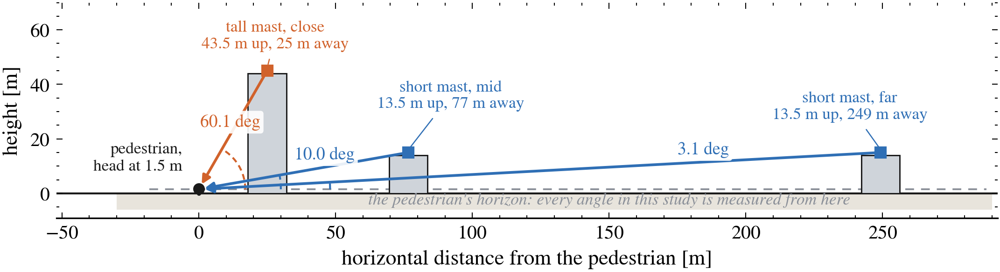
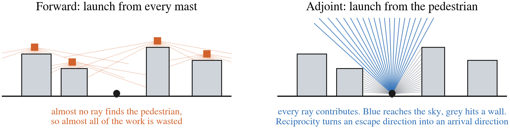
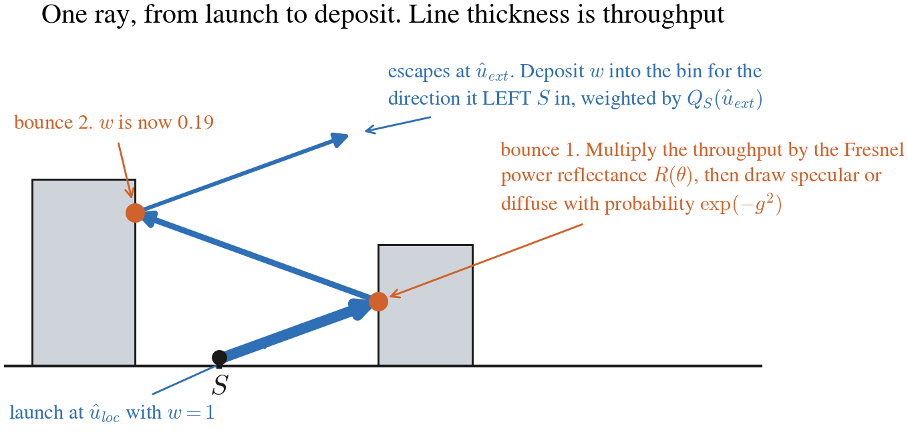
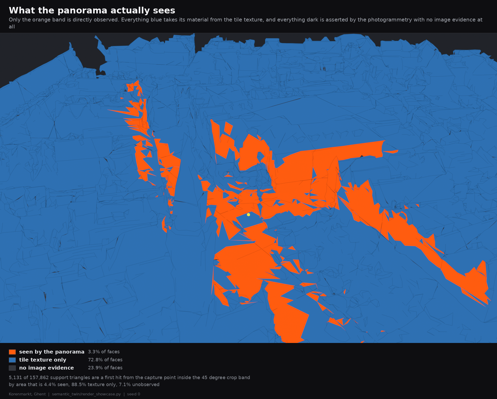
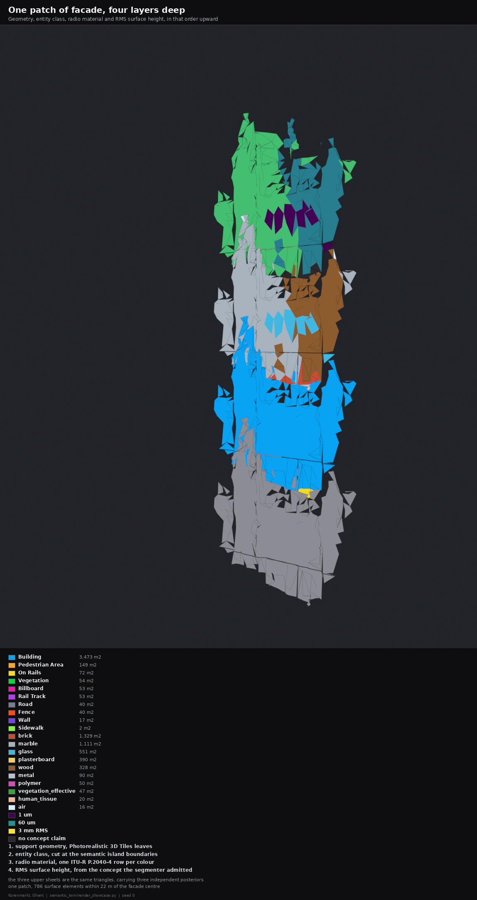
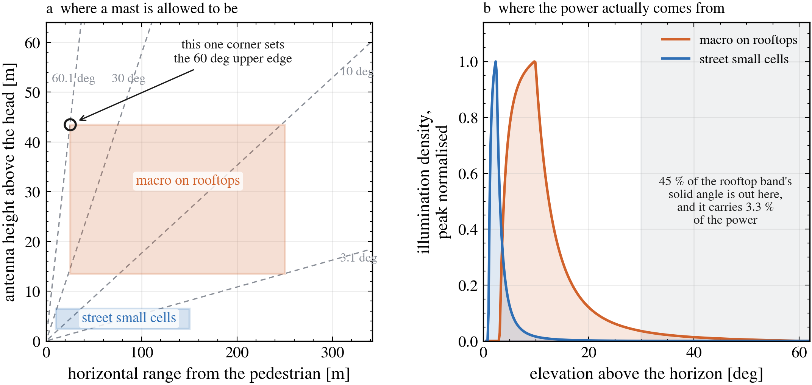
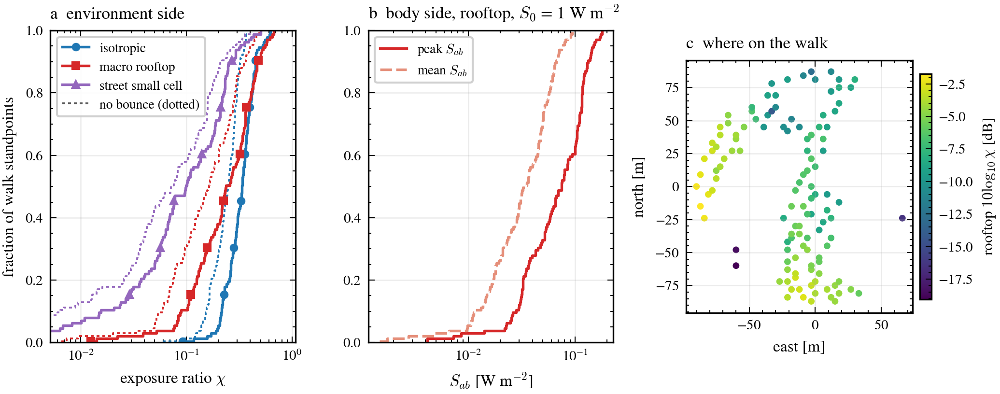
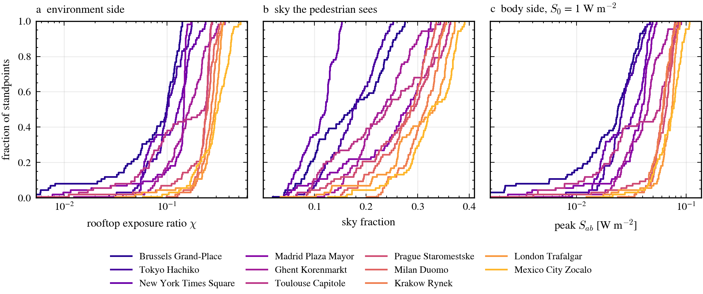
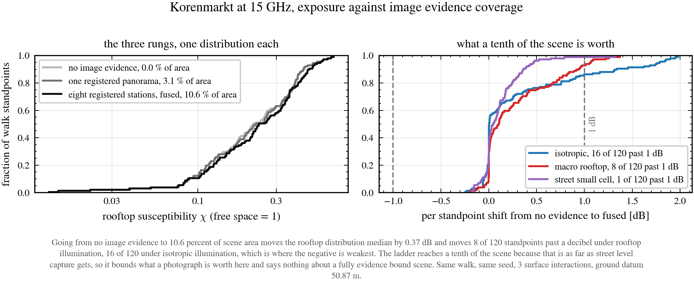
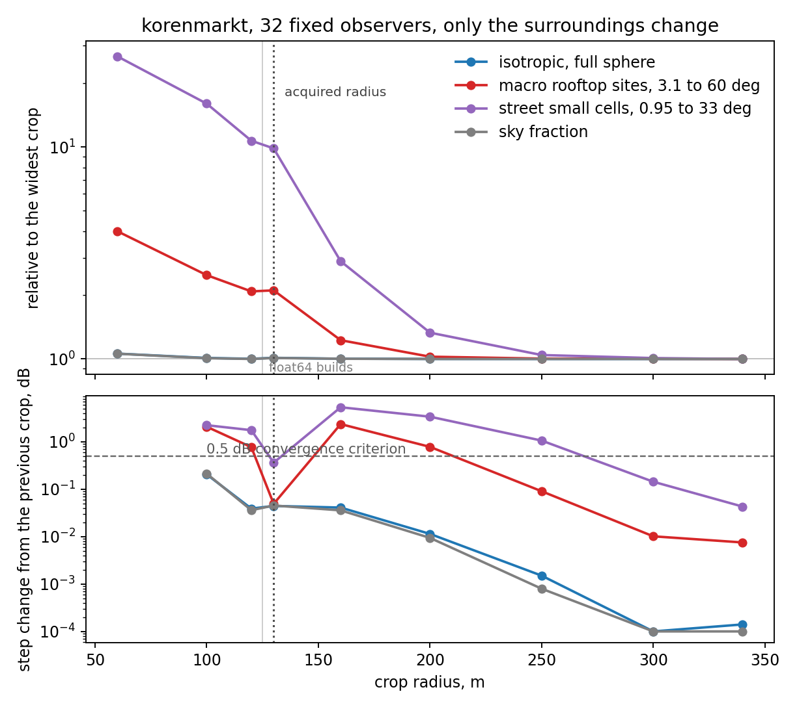

# Methods and results, end to end

Draft spine for an IEEE Access submission. Content first, prose later. Every
number here traces to a script in this repository, and the reproduction commands
are in the last section.

Notation is written for KaTeX so it renders outside LaTeX. The symbol table is
appendix A, at the end.

---

## 1. The question

### 1.1 The situation being modelled

Someone is standing in a city square. Above and around them, somewhere, are the
base stations of a 15 GHz network. The question is how much radio power reaches
where they are standing, and how much of that answer is set by the square itself
rather than by the network.

That last clause is the whole study. Two pedestrians in two different squares,
served by identically specified networks, do not receive the same power, because
one square is a narrow medieval funnel of tall stone and the other is an open
plaza with a low skyline. Eleven squares are measured here to find out how large
that difference is, and what about a square's shape predicts it.

The obstacle is that at 15 GHz there is no network to point at. Nothing above
6 GHz is deployed for cellular access anywhere in the 3.86 million antenna
records available for Europe (section 4.3.1). So the base stations cannot be
placed, and any result that depends on where they were placed is a result about
an invented layout.

### 1.2 The base stations are a density on the sky, not a list of masts

The way out is to stop placing them. Instead of one layout, take the whole
population of plausible mast positions, and ask what fraction of the network's
power would arrive at the pedestrian **from each direction of the sky** if the
buildings were not there. That fraction is a probability density over
directions, written $Q(\hat u)$ and normalised to one over the sphere. It is
built in section 4 from two explicit and swappable assumptions, a height
distribution and a range cap, so the assumption is visible rather than buried in
a coordinate list.

The direction a mast occupies on the pedestrian's sky is set by two numbers, how
far up it is and how far away, and only their ratio matters. Figure 1 makes the
point that decides most of section 4: a steep arrival angle does not mean a tall
mast, it means a **near** one.



**Figure 1.** Three sources on the boundary of the rooftop deployment model.
Elevation is measured from the pedestrian's own horizon at head height, so the
60 deg arrival is not something high above a roofline, it is a mast 43.5 m up at
only 25 m away, the single closest and tallest corner of the assumed deployment
box. The two 13.5 m masts differ only in range, and that alone moves them from
10 deg to 3 deg. Any statement of the form "sources between 3 and 60 degrees"
therefore describes a corner of a two dimensional box, not a physical band.

### 1.3 The quantity: how much the square changes the answer

Fix an observation point $\mathbf{x}$ at pedestrian head height. Define the **transfer
kernel** $K(\hat u)$ as the ratio of the power density arriving at $\mathbf{x}$ from
direction $\hat u$ in the real scene, to the power density the same source would
deliver at $\mathbf{x}$ with every building deleted. $K$ is dimensionless, it is a
property of the geometry and the materials alone, and it is identically $1$
everywhere in free space.

The **susceptibility** of the standpoint is the inner product of what the square
does to each direction with how much network power comes from that direction,

$$\boxed{\ \chi = \int_{4\pi} K(\hat u)\, Q(\hat u)\, d\Omega(\hat u)\ }
\tag{1}$$

and the power density that actually arrives is $S_{\rm arr} = S_0\,\chi$, where
$S_0$ is whatever the same network would have delivered in the open. So
$\chi = 1$ means the square is neutral, $\chi = 0.35$ means it costs 4.6 dB,
and the eleven site comparison is a comparison of these numbers.

Three properties make (1) the right thing to compute rather than a convenient
one.

1. **It equals 1 in free space by construction**, for every $Q$. Any
   implementation error that breaks this is visible without a reference solution.
2. **It is independent of network transmit power.** Absolute scale lives in the
   single explicit factor $S_0$ that the caller owns, so a result transfers
   between sites, between bands and between deployment densities without being
   recomputed.
3. **It factorises the environment from the body.** Section 7 composes the
   arriving angular density $\rho$ with a phantom by a second inner product, so
   neither computation needs to know about the other.

The claim being made is about **urban form**, and marginalising the source
population is what makes that claim possible. Marginalising is not the same as
ignoring: section 4.3 carries three deployment models rather than one, and every
result is reported under each, so a reader who disputes the assumption can read
off how much it mattered.

### 1.4 Why powers and never amplitudes

The estimator accumulates power. This is forced, not preferred.

An escaping path leaves the scene from its last scattering vertex $\mathbf x_K$.
Perturbing the exit direction by $\delta$ changes the path phase by
approximately $k\,|\mathbf x_K - S|\,\delta$. At 15 GHz, $\lambda = 20$ mm, and a
last vertex 100 m from the observer,

$$k\,|\mathbf x_K - S| = \frac{2\pi \times 100\ \mathrm{m}}{0.02\ \mathrm{m}}
\approx 3.1\times 10^{4}\ \text{rad per radian of exit angle}.$$

Holding the phase error below 1 rad therefore needs angular cells no wider than
$3\times10^{-5}$ rad, which is of order $10^{10}$ cells on the sphere. The grid
used here has 512. Summing amplitudes on any publishable grid is five to seven
orders of magnitude too coarse, and the failure is **silent**: it produces a
plausible number with no warning. Every quantity reported here is therefore a
band averaged second moment.

The consequence is stated rather than hidden: this method cannot produce a
coherent fading realisation, and does not claim to.

### 1.5 Notation

Four conventions, stated once so they do not have to be restated.

**Everything is at one standpoint.** $K$, $Q$, $\rho$ and $\chi$ are all
properties of a single observation point $\mathbf{x}$, and the whole study is a
distribution over standpoints. Carrying an $\mathbf{x}$ subscript on every symbol
would say nothing, so it is dropped, and where a formula genuinely needs the
point it appears as $\mathbf{x}$.

**Directions point outward.** $\hat u$ always leaves $\mathbf{x}$. A wave
arriving from $\hat u$ propagates along $\hat k = -\hat u$. Section 5.1 is where
that sign matters and it is the only place it appears.

**$d$ is only ever a differential.** Horizontal range is $r$, so $d\Omega$,
$d\alpha$ and $dh$ never have to be read twice. Finite increments are $\delta$.

**Capital for solid angle, lowercase for elevation.** $Q(\hat u)$ is a density on
the sphere in sr$^{-1}$; $q(\alpha)$ is its marginal in elevation in rad$^{-1}$.
Section 4.1 gives the factor between them. The same discipline separates the
admissible height window $W$ from the cell count $M$, and the ray throughput $w$
from the tissue transmission coefficient $T_0$, both of which were one letter in
an earlier draft.

Symbols are collected in appendix A.

### 1.6 How the rest of this document is arranged

Evaluating (1) needs three things: the scene, the density $Q$, and a way to do
the integral. They are built in that order.

| Section | What it produces |
|---|---|
| 2 | the scene: a mesh, a class per surface, a permittivity per class |
| 3 | image evidence, and how much of the scene it actually binds |
| 4 | the illumination density $Q$, from a source population |
| 5 | the estimator that evaluates (1) |
| 6, 7 | where the pedestrian stands, and how the body couples |
| 8 | validation |
| 9 | results, within one square and across eleven |
| 10, 11 | what threatens each result, and how firm each one is |

The estimator in section 5 runs the geometry **backwards**, which is worth
stating once at the outset because it is the least obvious design choice here.
Rays are not launched from the base stations towards the pedestrian. They are
launched from the pedestrian outwards, bounced until they escape the city, and
then scored by how much network power would have come from the direction they
escaped in. Figure 2 is why.



**Figure 2.** Left, the forward picture: sources are spread over the whole sky,
the pedestrian is a point, and essentially no launched ray ever lands on them.
Right, the adjoint picture: every ray starts at the pedestrian, so every ray
contributes, and the sky direction it eventually escapes in is exactly the
argument that $Q$ wants. Reciprocity makes the two equivalent, with the
dictionary $\hat k = -\hat u$. In the right panel blue rays reach the sky and
grey ones terminate on a wall, and the occlusion is computed rather than drawn,
so the visible sky wedge is the real one for this cross section.

Figure 3 follows one such ray end to end.



**Figure 3.** A single sample. The ray leaves $\mathbf{x}$ carrying throughput $w = 1$.
At each surface, $w$ is multiplied by the Fresnel power reflectance and the
Rayleigh roughness split decides whether the outgoing direction is specular or
diffuse. When the ray escapes, its surviving $w$ is deposited into the angular
bin of the direction it originally **left $\mathbf{x}$** in, weighted by $Q$ evaluated
at the direction it escaped in. Line thickness is $w$. Section 5.2 gives the
loop, including Russian roulette from bounce 3 and the four bounce operating
point.

---

## 2. Scene acquisition

### 2.1 Support mesh

Geometry comes from Google Photorealistic 3D Tiles, traversed from the root
tileset down to leaf level within a ball around the site anchor. Two details are
load bearing.

**Double precision placement.** A leaf carries its placement in Earth centred
Earth fixed coordinates, of order $6.4\times10^{6}$ m, in its glTF node matrix.
Blender's `Object.matrix_world` is single precision, whose spacing at that
magnitude is about 0.5 m. Reading placement through Blender therefore quantises
tile origins, producing a rigid shift of roughly 0.22 m and, worse, up to 0.44 m
of *differential* tile to tile seaming. At 15 GHz that is 22 wavelengths of
unrecoverable geometry error. The placement is therefore read from the container
in float64 and folded into vertex coordinates, and every object is left at the
identity. Meshes built this way carry `format_version: 3` in their manifest and
the loader refuses anything lower.

**The ROI ball is centred on the terrain, not the ellipsoid.** A ball of radius
$\varrho$ centred at ellipsoidal height 0 reaches only $\sqrt{\varrho^2 - H^2}$
horizontally at a site of ellipsoidal height $H$. Milan at $H = 163$ m received 116 m of scene from a
nominal 200 m request before this was fixed.

The site is then cropped to a horizontal radius $R_{\rm crop}$ about the anchor.
Section 9.4 shows $R_{\rm crop}$ is not a free parameter.

### 2.2 Surface classes

The photogrammetric mesh carries no material labels. A triangle is assigned to
one of four classes by an explicit geometric rule on its normal $\hat n$ and its
height above the local ground datum $z_0$:

| class | rule |
|---|---|
| ground | $\lvert n_z\rvert > 0.85$ and $z - z_0 < 2\ \mathrm{m}$ |
| roof | $n_z > 0.85$ and $z - z_0 \ge 2\ \mathrm{m}$ |
| soffit | $n_z < -0.85$ |
| facade | otherwise |

This is a stated placeholder for image evidence, not a substitute for it, and
section 3 measures exactly how much of the scene image evidence can replace.
Every run writes the rule into its manifest.

### 2.3 Electromagnetic parameters

Each class binds one ITU-R P.2040-4 material row and one roughness class. P.2040-4
gives the real permittivity and conductivity as power laws in frequency $f$ in
GHz,

$$\varepsilon_r' = a f^{\,b}, \qquad \sigma = c f^{\,d}\ \ [\mathrm{S\,m^{-1}}],$$

from which the complex relative permittivity follows with the negative imaginary
part convention,

$$\varepsilon = \varepsilon_r' - j\,\frac{\sigma}{2\pi f \varepsilon_0}.
\tag{2}$$

Defaults are ground to `asphalt_concrete`, facade to `brick`, roof and soffit to
`concrete`. Validity bands are enforced: a request outside a row's stated band
raises rather than extrapolating silently.

---

## 3. Image evidence

This layer exists to replace the geometric rule of section 2.2 with observed
material where a camera saw the surface. Section 10.3 reports what it is worth,
and the answer is not what the project assumed.

### 3.1 Panorama selection

Street level panoramas are selected by walking the capture link graph outward
from the site anchor rather than by querying a bounding box.

**The bounding box endpoint silently returns a sample.** Measured at Korenmarkt,
one bounding box query covering 200 m returned 43 images, of which 2 belonged to
a sequence that in fact has 13 frames inside 60 m of the centre. The response
carries no truncation flag, no paging cursor and no total count, so nothing
distinguishes a complete answer from a 15 % sample. The bias is spatially
structured: it thins dense drives first, removing exactly the short baselines a
multi view study needs. The fix is to use the box only to *name* sequences, then
enumerate each sequence by id.

The unit of merit is a **walk**: the largest set of panoramas sharing one capture
date and linked to each other. Sites carry 5 to 21 capture dates within 60 m and
panoramas almost never link across dates, so a raw count overstates what a single
traverse reaches.

From the walk, $n$ panoramas are chosen by **farthest point sampling** seeded at
the panorama nearest the centre. This maximises the minimum separation, and it is
prefix optimal, so a run truncated by an API quota still holds the most spread
subset of what it managed. Extent binds harder than count: widening a site from
60 m to 80 m lifts achievable surface coverage from 30.6 % to 44.8 % of scene
area, worth more than tripling the camera count in the middle.



**Figure 4.** How little of a square a street level camera reaches. One
registered panorama is a first hit on 3.3 % of support triangles and 4.4 % by
area. Fusing twelve raises directly observed surface to 24.1 % by area and then
saturates: twelve panoramas reach 77 % of what the site can ever offer and
twenty six reach 90 %, which sets the per site budget at twelve to sixteen. The
remaining half of the scene is roofs, courtyards and rear elevations that no
street level capture ever sees, and that ceiling is the reason section 9.3 can
only test a partially evidence bound scene.

### 3.2 Registration

Each panorama arrives with a coarse pose from capture metadata. That pose is
refined against the mesh skyline: the segmentation gives a sky mask, the mesh
gives a predicted horizon, and the pose is the argument minimising the mean
angular disagreement between the two silhouettes.

Three defects were found and fixed here, all of which had shipped:

1. Capture metadata carries a measured gravity tilt that was being discarded and
   replaced by a hardcoded upright assumption, throwing away tilts of 4.5, 7.8 and
   26.8 degrees already on disk.
2. The altitude search bound was **load bearing**. Every pose previously shipped
   sat within 0.1 m of the floor. Widening it is the wrong fix, because the
   optimiser then buys residual by sinking the camera below the pavement: it is
   compensating a systematic bias, since photogrammetry rounds off balustrades
   and pinnacle tips so the mesh skyline sits low.
3. Camera ground height was one scene wide constant applied regardless of
   distance from the origin. It is now a per camera downward ray cast.

The reported residual is **not an error bar**. An eight seed repeat at Korenmarkt
spans a 3 m by 2.5 degree valley at equal cost, so poses ship with a seed spread
rather than a single number.

### 3.2.1 The residual cannot see the dominant failure mode

An independent second opinion is available for free: the fishnet reports pixels
that segmentation calls sky but for which the mesh returns a first hit.
Segmentation says sky, geometry says surface. That is a registration conflict
computed by a route entirely independent of the skyline objective, and it is
decisive.

Over the 83 registered poses of this study, split at a conflicting sky fraction of
one half:

| | poses | median residual | residual range | median slack to bound | median range to conflicting geometry |
|---|---|---|---|---|---|
| conflict $< 0.5$ | 43 | 1.30$^\circ$ | 0.22 to 11.46 | 1.807 m | **27.11 m** |
| conflict $\ge 0.5$ | 40 | 6.40$^\circ$ | 0.18 to 12.00 | **0.046 m** | **0.66 m** |

The last column is the argument. In the failing half the rays that segmentation
calls sky terminate 0.66 m from the lens, so the camera is inside the geometry and
the optimiser put it there. Consistently with that, those poses sit 4.6 cm from
the altitude search bound rather than at an interior optimum.

**No residual threshold separates these two groups.** Their residual ranges overlap
almost completely, 0.22 to 11.46 degrees against 0.18 to 12.00. The counterexample
is explicit: the best skyline residual in the entire cohort, 0.176 degrees at
Madrid pano_08, has 100 % of its sky conflicting. That camera stands under the
Plaza Mayor arcade, the only visible sky is one arch, and the fit scored 0.176
degrees on the handful of columns inside that patch. The pose is not accurate to a
sixth of a degree, it is unconstrained, and the objective it was fitted with cannot
tell the difference.

Reopening the altitude bound does not find an interior optimum either. At Times
Square pano_00 a $\pm 3$ m search pins at $-3.00$ m with residual 9.52 degrees,
$\pm 8$ m runs to $-7.81$ m at the same 9.52, and $\pm 25$ m runs to $-22.60$ m at
7.45. Monotone improvement with depth is the signature of a nuisance parameter
absorbing the mesh skyline bias, not of convergence.

The practical consequence is that a pose gate must consume the conflict fraction
rather than the residual. 30 of the 83 poses are pinned against a 3 m altitude
bound, and a 4 degree residual threshold passes many of them.

### 3.3 Fishnet: cutting the surface against the image

The naive approach tiles the label image and splats tiles outward onto the mesh.
The fishnet reverses the direction of travel: each support triangle is projected
into image space, cut there against semantic island boundaries, and the pieces are
mapped back onto the triangle's own plane.

This works because within one rectilinear crop the camera is a pinhole, so a
triangle maps to a triangle under an invertible projective map. The inverse used
is **not** barycentric interpolation of the projected corners, which is wrong
under perspective, but the exact intersection of the pixel ray with the triangle's
supporting plane. Verified against a BVH depth buffer over all 707,620 first hit
pixels of one view: median residual $4.7\times10^{-7}$ m, 95th percentile
$3.7\times10^{-6}$ m, worst case $1.9\times10^{-5}$ m.

Two guards are mandatory:

- **Near plane clipping.** At one Korenmarkt view, 4 of 1,431 visible triangles
  have a vertex behind the camera plane and those 4 own 33.5 % of the hit pixels.
  They are the large ground triangles under the camera. Unclipped, they project to
  garbage.
- **Bijection holds on the visible surface only.** Two triangles routinely
  project to the same pixel. The mesh first hit identifier decides ownership and
  any piece owned by a different triangle is rejected rather than painted.

Each output face carries class, class posterior, material posterior, confidence,
outward normal, metric area, solid angle from the capture point, and provenance.
Rejected faces are kept in a parallel table with the reason, so
`clutter_in_front` stays distinguishable from `transient_object`. That distinction
matters: a pedestrian's monocular depth often agrees with the wall behind them, so
only the class can reject them, while a parked van is rejected by depth.

### 3.4 Binding evidence to the tracer



**Figure 5.** What the fishnet hands the tracer. Support geometry at the bottom,
then entity class, radio material and RMS surface height stacked above it. The
three upper sheets are the same triangles carrying three independent posteriors,
which is what distinguishes this from a textured mesh: the tracer reads a
material distribution per face, not a colour.


Faces seen by at least one registered panorama take their material from the fused
posterior. Everything else keeps the geometric rule of section 2.2. Each run
writes the covered fraction by face and by area into its manifest, and those two
numbers are the honest statement of how much of the result is evidence based.

---

## 4. Illumination: integrating over base station position

### 4.1 The construction

Consider base stations scattered on the ground at uniform areal density $\nu$, each
at height $h$ above the pedestrian head and horizontal range $r$, so the
elevation at which the pedestrian sees it is $\alpha = \arctan(h / d)$.
The goal is to convert *sites per unit ground area*, which is what a deployment
has, into *sites per unit elevation*, which is what the sky looks like from the
standpoint.

Count them in rings. The ring between range $r$ and $r + \delta r$ has area
$2\pi r\, \delta r$, so it holds $2\pi \nu\, r\, \delta r$ sites. Now express both
factors in elevation. Inverting the elevation relation at fixed height,

$$r(\alpha) = h \cot \alpha,
\qquad
\left| \frac{\partial r}{\partial\alpha} \right|
= \frac{h}{\sin^{2} \alpha} ,$$

where the absolute value is taken because range *decreases* as elevation rises,
and a count of sites has to come out positive. A slab of elevation of width
$\delta\alpha$ is therefore the image of a ring of width
$\delta r = |\partial r / \partial\alpha|\ \delta\alpha$, and it
contains

$$\delta N
= 2\pi \nu\, r(\alpha) \left| \frac{\partial r}{\partial\alpha} \right|
\delta\alpha
= 2\pi \nu\, h^{2}\,
\frac{\cos \alpha}{\sin^{3} \alpha}\, \delta\alpha.
\tag{3}$$

The $\sin^{-3}$ is the whole story: sites at low elevation are far away, and the
area of ground at a given range grows with that range, so the far ring is
enormous and it projects into a very thin slab of sky just above the horizon.

Equation (3) counts sites per unit **elevation**. The estimator of section 5
wants power per unit **solid angle**. These are different measures and confusing
them is silent, so both are carried explicitly and given different letters:
$q(\alpha)$, in rad$^{-1}$, is the marginal in elevation, and $Q(\hat u)$, in
sr$^{-1}$, is the density on the sphere of section 1.3. For a model with no
azimuthal preference, integrating $d\Omega = \cos\alpha\ d\alpha\ d\phi$ over
azimuth relates them by

$$q(\alpha) = 2\pi \cos\alpha\ Q(\hat u(\alpha)),
\qquad\text{equivalently}\qquad
Q = \frac{q(\alpha)}{2\pi\cos\alpha} .$$

The factor $\cos\alpha$ is the width of the elevation slab on the sphere, and
dropping it is the single easiest way to get this wrong.

| | $q(\alpha)$, density in elevation | $Q(\hat u)$, weight on $d\Omega$ |
|---|---|---|
| uniform sites, no path loss | $\propto \cos\alpha/\sin^{3}\alpha$ | $\propto 1/\sin^{3}\alpha$ |
| uniform sites, $r^{-2}$ weighting | $\propto 1/(\sin\alpha\cos\alpha)$ | $\propto 1/(\sin\alpha\cos^{2}\alpha)$ |

The second row weights by the **horizontal** range $r$, not by the slant range
$h/\sin\alpha$. The two coincide near the horizon and differ by a factor of 4 in
power at 60 degrees, so the choice has to be stated. Slant weighting would give
$\cos\alpha/\sin\alpha$ in elevation and $1/\sin\alpha$ on $d\Omega$ instead.

Both are heavily low elevation weighted. Under the rooftop support, 61.7 % of the
pure geometric weight sits below 5 degrees.

A note on that number, because an earlier draft of this work carried 64 %. That
figure is not reproducible from the support the code actually used. On
$[3.1^\circ, 60.1^\circ]$ the closed form gives 61.74 %, and 64.18 % requires a
$3.0^\circ$ lower edge that no version of the model ever ran. 61.7 % is the figure
that describes the published runs, and the support tuple is now pinned by test
alongside all three values so the two cannot drift apart again.

### 4.2 The two caps, and why a hard elevation band cannot express them

Two physical limits bound the source population. There is a **maximum height** a
base station plausibly occupies, and a **maximum range** beyond which the link
stops mattering. The obvious encoding is to state a height band
$[h_{\min}, h_{\max}]$ and a range band $[r_{\min}, r_{\max}]$ and
truncate the elevation support to
$[\arctan(h_{\min}/r_{\max}),\ \arctan(h_{\max}/r_{\min})]$.

**That encoding is wrong, and this draft corrects it.** Equation (3) is derived at
a *single* height. Truncating its support using the extremes of a height *band*
describes no actual source population, because the two caps interact. At the
0.95 degree lower limit of the small cell model, a 2.5 m source needs 150 m of
range but a 6.5 m source needs 390 m. A hard band admits both, and so buys
illumination from sources that violate its own range cap, at exactly the low
elevations that dominate the measure.

Carrying the integral out properly means asking, at each elevation, which
heights are actually admissible once **both** caps are imposed. Let $f_h(h)$ be
the height distribution over $[h_{\min}, h_{\max}]$, and let the range be
confined to $[r_{\min}, r_{\max}]$. A source at height $h$ appears at elevation
$\alpha$ only if its implied range $h \cot\alpha$ lies inside the range band,
which bounds $h$ between $r_{\min}\tan\alpha$ and $r_{\max}\tan\alpha$.
Intersecting that with the height band gives the admissible interval
$[a(\alpha), b(\alpha)]$ below. Weighting it by $h^{2}$, which is the Jacobian
factor already visible in (3), defines the **admissible height window**
$W(\alpha)$, in m$^{3}$:

$$q(\alpha) \ \propto\ \frac{1}{\sin^{3}\alpha}\; W(\alpha),
\qquad
W(\alpha) = \int_{a(\alpha)}^{b(\alpha)} f_h(h)\, h^{2}\, dh,
\tag{4}$$

$$a(\alpha) = \max\!\big(h_{\min},\, r_{\min} \tan \alpha\big),
\qquad
b(\alpha) = \min\!\big(h_{\max},\, r_{\max} \tan \alpha\big),$$

with $W = 0$ wherever $b < a$, meaning no height at all can produce that
elevation without violating a cap. $W$ is a **smooth** roll off, not an
indicator: near the edges of the support the admissible interval shrinks
continuously to nothing rather than switching off. It reduces to a hard indicator only in the single height case that (3)
actually describes. For a uniform height distribution it is available in closed
form, $W \propto (b^3 - a^3)$.

The support of (4) is indeed
$[\arctan(h_{\min}/r_{\max}), \arctan(h_{\max}/r_{\min})]$, so the
previously stated support was right. What was wrong was assuming the weight was
flat across it. A plateau where the whole height band is admissible exists only
when $h_{\max}/r_{\max} \le h_{\min}/r_{\min}$, which holds for both
deployment types considered here.

The consequence is that the uncorrected model **over weights both tails**, the low
one most, and the low tail is precisely what drives the crop radius requirement of
section 9.4. Figure 6 shows both halves of the argument.



**Figure 6.** Left, the deployment models are rectangles in the
(range, height) plane, and lines of constant elevation are rays through the
origin. The 60.1 deg upper edge of the rooftop model is contributed by a single
corner of the rectangle, and the 3.1 deg lower edge by the opposite one, which is
why the elevation support alone is a poor description of the population. Right,
the density (4) that the rectangle actually induces. It is sharply peaked near
the low edge and decays hard: 45 % of the rooftop band's solid angle lies above
30 deg and carries 3.3 % of the power. Curves are the production
`elevation_band_measure`, peak normalised for display.

The measured effect of the correction is site dependent and large. At Korenmarkt
it raises the rooftop susceptibility by 5.27 dB and the street one by 4.27 dB,
across the eleven squares the per site shift spans 1.06 to 6.33 dB, and because
the shift is not common mode it **reorders the cities**. Section 9.2 reports it.

### 4.3 The three models used

| name | $h$ [m] | $r$ [m] | elevation support [deg] |
|---|---|---|---|
| isotropic | | | $-90$ to $90$, uniform |
| macro rooftop | 13.5 to 43.5 | 25 to 250 | 3.1 to 60.1 |
| street small cell | 2.5 to 6.5 | 10 to 150 | 0.95 to 33.0 |

The isotropic model is a control, not a deployment. It is uniform over $4\pi$, so
$\chi$ under it reduces to a purely geometric openness measure and carries no
network assumption at all. Reporting it beside the directional models separates
what the built form does from what the deployment assumption does, and section
10.1 shows that separation is the main result.

### 4.3.1 There is no deployment to calibrate these against

The six numbers above were substantiated against national antenna registers, and
the result is a negative that changes how they must be presented. Full working in
`DEPLOYMENT_GEOMETRY.md`.

Across 3,863,228 European antennas in the AEGIS base station database, the number
of **cellular access antennas above 6 GHz is zero**. France, the Netherlands,
Spain, Poland and Brussels all return zero. The only above-6 GHz rows anywhere are
15,140 UK Ofcom entries whose technology is fixed link, point to point backhaul at
a 22 GHz median, which is not access. So there is no deployed FR3 or FR2 base to
calibrate a height distribution against, and that is an absence of the deployment
rather than a gap in the data.

The obvious fallback, extrapolating a height versus frequency trend out of the
sub-6 registers, is **falsified rather than merely unavailable**. Deployed centre
height is flat in carrier frequency, and if anything rises:

| register | 0.7 to 1.0 GHz | 1.8 to 2.1 GHz | 2.6 GHz | 3.5 GHz n78 |
|---|---|---|---|---|
| Netherlands | 30.0 m | 29.6 m | 30.2 m | **31.8 m** |
| Brussels | 26.8 m | 26.7 m | 27.1 m | **27.8 m** |
| France | 28.0 m | 27.0 m | 26.2 m | |
| Poland | 40.0 m | 40.0 m | 40.0 m | |

Operators co-site every band on one mast, because the binding constraint is site
acquisition rather than radio. That kills the trend fit and simultaneously
supplies a better justification for using sub-6 macro heights as the macro prior:
not the same band, but the same real estate. Its failure mode is stateable, which
is the point of preferring it. If FR3 arrives by densification rather than as an
overlay, the new sites appear at street level and the small cell class carries
them, which is why the model keeps two classes rather than one broad band.

The two class structure has independent support in the same data. Deployed heights
are bimodal, thinly populated between roughly 6 and 18 m, which is a property
market fact, a roof lease or a lamppost lease with little in between, and property
markets do not care about carrier frequency.

**The closest published analogue lands between the two bands.** The Ericsson
Kista campaign is the nearest thing in the literature to what this study models:
15 GHz, an enclosed European square, an elevated base station and a pedestrian
height receiver, measured to 250 m. Its two base stations sit at 8.5 and 12 m
above ground, which is **below the macro band's 15 m floor and above the small
cell band's 8 m ceiling**. On the face of it the study has no class for the one
deployment it can point at.

That turns out not to matter, because the model consumes an elevation
distribution and not a height. Running the same band law on the Kista geometry
and comparing where each class puts its weight:

| model | height above ground | below 5 deg | 5 to 20 deg | above 20 deg |
|---|---|---|---|---|
| street small cell | 4 to 8 m | 87.9 % | 11.8 % | 0.3 % |
| Kista, as measured | 8.5 to 12 m | 84.0 % | 15.3 % | 0.8 % |
| macro rooftop | 15 to 45 m | 9.4 % | 80.8 % | 9.8 % |

A source in the height gap is illuminationally a small cell, not something
between the classes: it differs from the street model by 3.9 points of grazing
measure and from the rooftop model by 75. So the gap in the height axis is not a
gap in the modelled space, and the two class structure survives its own most
awkward evidence.

**So the caps are assumptions, and the paper reports a sensitivity rather than a
citation.** Measured leverage: the range cap is worth 7.8 dB across a defensible
100 to 400 m span, the height band 0.7 to 2.0 dB across its own. Height spans a
factor of 3.2 while range spans a factor of 10, which is what decides it. Per site
the range cap sensitivity runs from 0.6 dB at Krakow to 10.0 dB at Brussels and
Madrid, so the illumination assumption concentrates in exactly the deep canyon
sites that carry the most interpretive weight. Reporting $\chi$ at 150, 250 and
400 m is the honest presentation.

### 4.4 Normalisation

$Q$ is normalised by quadrature in elevation and not on the direction grid:

$$\mathcal N = 2\pi \int_{\alpha_{\min}}^{\alpha_{\max}}
w(\alpha)\, \cos\alpha \ d\alpha,
\qquad Q = w / \mathcal N .$$

This matters because a $1/\sin^3$ law puts most of its mass in the first few
degrees above the horizon, which a few hundred cell direction grid cannot
resolve. For the same reason, any numerical comparison against $Q$ must integrate
each bin rather than sample its midpoint: $1/\sin^3$ is convex, so the midpoint
rule underestimates, and it underestimates most in the widest bin. Read at face
value that quadrature error looks like a factor of six error in the physics.

---

## 5. The adjoint shoot and bounce estimator

### 5.1 Formulation

Computing $K(\hat u)$ forward, by launching from every plausible source and
seeing what reaches $\mathbf{x}$, wastes essentially all of the work. The adjoint form
launches from $\mathbf{x}$ instead, as in figure 2. Figure 3 is one sample of what
follows.

By reciprocity, a ray leaving $\mathbf{x}$ in direction $\hat u_{\rm loc}$ and escaping the
scene in direction $\hat u_{\rm ext}$ with accumulated power throughput $w$ is the
reverse of a path that would carry a fraction $w$ of the power from a source at
$\hat u_{\rm ext}$ into arrival direction $\hat k = -\hat u_{\rm loc}$ at $\mathbf{x}$. The
departure direction is the local arrival direction, so no sign conversion is
needed anywhere downstream.

Sampling $N$ rays with $\hat u_{\rm loc}$ uniform on the sphere gives the estimator

$$\boxed{\ \hat\chi = \frac{4\pi}{N}\sum_{j=1}^{N} w_j\, Q(\hat u_{{\rm ext},j})\ }
\tag{5}$$

where the sum runs over escaping rays only. Resolved by arrival direction, with
the sphere partitioned into $M$ near equal solid angle cells of a Fibonacci
spiral,

$$\rho_c = \frac{1}{n_c}\sum_{j \in c} w_j\, Q(\hat u_{{\rm ext},j}),
\qquad
\hat\chi = \sum_{c=1}^{M} \rho_c\, \Delta\Omega,
\qquad \Delta\Omega = \frac{4\pi}{M}.
\tag{6}$$

**Free space check.** With no geometry every ray escapes on its first segment with
$w=1$ and $\hat u_{\rm ext} = \hat u_{\rm loc}$, so
$\mathbb E[\hat\chi] = 4\pi\, \mathbb E[Q(\hat u)] = 4\pi \cdot \frac{1}{4\pi}\int Q \, d\Omega = 1$
for any $Q$. This is a parameter free identity, not a calibration.

### 5.2 The bounce loop

For each ray, from the current position $\mathbf x$ and direction $\hat u$:

1. **Intersect** the support mesh. No hit means the ray escapes; deposit it into
   (6) and stop.
2. **Advance** to the hit point, accumulate path length, orient the surface normal
   against the incoming ray, and form $\cos\theta = -\hat u \cdot \hat n$.
3. **Attenuate** by the unpolarised power reflectance of the surface class,

   $$R(\theta,\varepsilon) = \tfrac12\Big(|\Gamma_{\rm TE}|^2 + |\Gamma_{\rm TM}|^2\Big),$$

   $$\Gamma_{\rm TE} = \frac{\cos\theta - \sqrt{\varepsilon - \sin^2\theta}}
   {\cos\theta + \sqrt{\varepsilon - \sin^2\theta}},
   \qquad
   \Gamma_{\rm TM} = \frac{\varepsilon\cos\theta - \sqrt{\varepsilon - \sin^2\theta}}
   {\varepsilon\cos\theta + \sqrt{\varepsilon - \sin^2\theta}} .
   \tag{7}$$

   Set $w \leftarrow w\,R$.
4. **Split specular against diffuse** by the Rayleigh coherent fraction,

   $$\kappa = \exp\!\big(-g^{2}\big),
   \qquad g = \frac{4\pi s \cos\theta}{\lambda},
   \tag{8}$$

   where $s$ is the RMS surface height of the class and $\kappa$ is the fraction
   of the reflected power that stays coherent. It is a scalar fraction, not an
   angular density, which is why it is not written $\rho$.

   With probability $\kappa$ the new direction is the mirror
   $\hat u - 2(\hat u\cdot\hat n)\hat n$, otherwise it is drawn cosine weighted
   about $\hat n$. Note the $\cos\theta$: a surface that is rough at normal
   incidence is smooth at grazing, and this is the only place that angle
   dependence enters.
5. **Russian roulette** from bounce 3 onward. Survive with probability
   $p = \mathrm{clip}(w, p_{\min}, 1)$ and set $w \leftarrow w/p$ on survival,
   which is unbiased.
6. Stop at $L$ surface interactions. Rays still travelling are dropped and their
   throughput is reported as `truncated_throughput_share`, so truncation is a
   measured quantity rather than an assumption.

### 5.3 Byproducts that cost nothing

**Sky fraction.** $f_{\rm sky}$ is the fraction of rays escaping with zero
bounces. It is a purely geometric openness measure and it is used as a
walkability gate in section 6.

**Excess delay.** For an escaping ray with total path length $\ell_K$ and last
vertex $\mathbf x_K$,

$$\Delta = \ell_K - \hat u_{\rm ext}\cdot(\mathbf x_K - S),
\tag{9}$$

which is the extra path relative to a plane wave arriving from
$\hat u_{\rm ext}$. Throughput weighted, this is the mean excess delay.

### 5.4 The one simplification, stated

Polarisation is carried as the unpolarised power average (7) rather than a
$2\times2$ Jones matrix, so the coherency matrix is taken isotropic in the
transverse plane. This is exact for the depolarised multi bounce tail and for the
closed form checks of section 8, where both polarisations are averaged anyway. It
loses the cross polarisation ratio, which nothing downstream in this study
consumes.

### 5.5 Storage

Nothing that scales with the ray count reaches disk. Each standpoint reduces to a
row of scalars plus one few hundred cell angular spectrum, appended to a JSONL
file, and the paths are discarded. A run is therefore restartable and survives
being killed.

The single exception is a capped path recorder used only for figures. It is
bounded by a capacity set at the call site, it is off in every production run, and
it is asserted by test to leave every traced number bit identical, so the rays
drawn in a figure are the rays that were integrated.

---

## 6. Standpoint sampling

Walkable ground is decided by ray casting, not by a map layer. Over a candidate
grid of spacing $\Delta$ within radius $R_{\rm walk}$ of the anchor:

1. cast downward, keep the first hit;
2. require a near horizontal face, $\lvert n_z\rvert \ge 0.85$;
3. require the hit within a tolerance of the square's ground datum, which rejects
   roofs and bridged geometry;
4. require a clearance standoff so the head is not inside a wall or a market
   stall;
5. require $f_{\rm sky} \ge 10^{-2}$, which is the test that catches a standpoint
   inside a building. A clearance test alone does not: a point in the middle of a
   large room has metres of space in every direction and passes, then traces to a
   susceptibility seven orders of magnitude below its neighbours.

Survivors are chained by greedy nearest neighbour into a walk, and a run traces a
stratified subset of it.

**This is a walk, not a sampling design, and the distinction is load bearing.** A
contiguous split half of one site's standpoints gives a Kolmogorov statistic of
0.53 with medians a factor of 2.7 apart. Any claim that a within square
distribution is area representative needs a designed sample instead, and this
draft does not make that claim.

---

## 7. Body coupling

The environment side and the body side are computed independently and composed by
an inner product of two spherical functions. No dosimetry is reimplemented here:
$\rho$ is handed to an existing engine.

For a plane wave of incident power density $S_{\rm inc}$ arriving along $\hat k$,
the absorbed power density at a body surface point with outward normal
$\hat n(\mathbf r)$ is

$$S_{ab}(\mathbf r) = S_{\rm inc}\, T_0\, \mathrm{ReLU}\!\left[\hat n(\mathbf r)\cdot(-\hat k)\right],
\tag{10}$$

with $T_0$ the tissue power transmission coefficient at normal incidence from a
Cole-Cole dispersion. The rectifier is the statement that a surface element only
absorbs from the hemisphere facing the source.

The traced spectrum enters as a set of plane waves, one per occupied direction
cell, with $\hat k_c = -\hat u_c$ and incident density $\rho_c \Delta\Omega\, S_0$.
Integrated quantities follow:

$$P_{\rm abs} = \oint S_{ab}\, dA,
\qquad
\mathrm{SAR}_{\rm wb} = \frac{P_{\rm abs}}{m_{\rm body}} .$$

The phantom is the IT'IS adult male, standing, 72.4 kg, 56,024 surface triangles.

**A free consistency check.** Dividing $P_{\rm abs}$ by the mean $S_{ab}$ recovers
1.956 m$^2$, an adult male body surface area, from two independently computed
quantities.

---

## 8. Validation

The ladder runs from closed form to convergence, and every rung is a test in the
suite rather than a one off.

### 8.1 Parameter free identities

**Zero bounce isotropic susceptibility equals the sky fraction.** Under
$Q = 1/4\pi$, the zero bounce part of (5) is $4\pi \cdot N_{\rm sky}/N \cdot
1/4\pi = f_{\rm sky}$. Measured: median 0.2599 against 0.2599, agreeing to every
digit printed. One check exercises the direction binning, the solid angle weights,
the occlusion test and the normalisation simultaneously.

**Free space returns exactly 1**, for every illumination model.

#### What section 8 cannot catch

Every test here is either an invariant the estimator was built to satisfy or a
closed form derived from the same physics the estimator implements. There is no
independent solver in the loop: nothing here is a comparison against a
second implementation of the same problem, and no measurement is taken anywhere
in this work. So the suite is strong against implementation error and blind to
formulation error. If the illumination construction or the reciprocity
dictionary were conceptually wrong, free space would still return 1, the
conducting plane would still return 2, and the cavity would still conserve
energy. The correction in section 4.2 is a case in point: it was found by
rederiving the integral, not by any test failing.

### 8.2 Closed forms

| case | closed form | measured |
|---|---|---|
| perfectly conducting ground plane | $\chi = 2$ exactly | exact |
| dielectric ground plane, 9 elevation bands | band averaged Fresnel | 1.02 % |
| Lambertian plane | $K = 1 + 2\sin\alpha$ | exact |
| ground plane excess delay | $\Delta = 2z\sin\alpha$ for an observer $z$ above the plane, mean $z/2$ throughput weighted | 2 % |
| closed lossless cavity | energy conserving | pass |

The perfect conductor case **cannot discriminate**: both polarisations reflect
fully, so it returns 2 whether the Fresnel average is right, TE only or TM only.
The concrete plane can, and it rejects the TE only answer at every band where the
two separate. A validation that cannot fail is not a validation, and this pair is
the difference.

### 8.3 Convergence, measured rather than assumed

| parameter | curve | operating point |
|---|---|---|
| bounce depth $L$ | $\chi = 0.29894$ at $L=4$ against $0.29902$ at $L\ge6$; truncated throughput share $0.567$ at $L=1$, $6.9\times10^{-4}$ at $L=4$, $0$ by $L=8$ | $L=4$ |
| ray count $N$ | $f_{\rm sky} = 0.24596$ at $2\times10^{5}$, $0.2459935$ at $2\times10^{6}$ | $2\times10^{5}$ |
| crop radius $R_{\rm crop}$ | section 9.4 | 250 m |

---

## 9. Results

All numbers at 15 GHz, the FR3 midpoint, with $S_0 = 1$ W m$^{-2}$. Every
absolute quantity is linear in $S_0$, so it is a scale factor and not a physical
claim.

### 9.1 Within one square

120 standpoints at Korenmarkt, fifth to ninety fifth percentile:

| illumination | $p_{05}$ | median | $p_{95}$ | spread |
|---|---|---|---|---|
| isotropic | 0.195 | 0.314 | 0.441 | **3.5 dB** |
| macro rooftop | 0.022 | 0.138 | 0.393 | **12.5 dB** |
| street small cell | 0.004 | 0.066 | 0.274 | **18.0 dB** |

**The illumination model matters more than the position.** Standing anywhere in
one square changes exposure by 3.5 dB under isotropic illumination, by 12.5 dB
under rooftop macro sites and by 18 dB under street small cells, because
directional sources arrive in narrow elevation bands that the built form either
admits or blocks completely.

Carried to the body, the same standpoints give a peak $S_{ab}$ spanning 12.7 dB
and a whole body SAR spanning 13.0 dB. The dosimetric endpoint inherits the
illumination geometry's spread, not the scene's average openness.



**Figure 7.** Korenmarkt over 120 standpoints. Left is the environment side, the
susceptibility under the three illumination models. Middle is the body side,
absorbed power density through the phantom. Right places each standpoint on the
ground. The spatial panel carries the point: the open square runs 10 to 15 dB
hotter than the streets leaving it, and that is geometry rather than material.

### 9.2 Across eleven squares

80 standpoints per city, common 250 m crop, identical material prior, so only
urban form varies.

**No image evidence enters this table.** Every run here is `materials:
geometric`, the orientation rule of section 2.2, at
`covered_fraction_by_area = 0.0` for all eleven sites including Korenmarkt. That
is a defensible control, since a comparison in which materials also varied would
confound urban form with material assignment, and section 9.3 measures the
material term separately. But it is also the only run the pipeline can produce:
`run_exposure.py` refuses `--materials semantic` or `--materials walk` at any
site except Korenmarkt, because no other site has a binding.

The gap between what the semantic stage produces and what this table consumes is
worth stating plainly, because it is large.

| stage | built for | reaches this table |
|---|---|---|
| panoramas acquired | 10 of 11 sites | none |
| skyline registrations | 83 poses at 9 sites | none |
| fishnet surfaces | 2 sites | none |
| SAM 3 material axis | 2 panoramas | none |

Krakow, London and Toulouse have no panoramas at all, so a materially bound
eleven city comparison is not merely unbuilt, it is unacquirable without
returning to those three sites. Sixty nine of the 83 registrations, at Brussels,
Madrid, Mexico City, New York, Prague and Tokyo, are computed and audited in
section 3.2.1 and then consumed by nothing. The claim this table supports is
therefore about **built form under a common material assumption**, and the word
semantic in this pipeline's name describes section 9.3's Korenmarkt experiment
rather than the eleven city result.

| site | isotropic median | rooftop, superseded | rooftop, corrected | street, corrected | isotropic spread [dB] | rooftop spread [dB] |
|---|---|---|---|---|---|---|
| Krakow Rynek | 0.5304 | 0.7052 | **0.9001** | 0.4600 | 0.77 | 2.26 |
| Toulouse Capitole | 0.3992 | 0.0981 | **0.3383** | 0.0318 | 2.31 | 5.30 |
| Mexico City Zocalo | 0.3974 | 0.0816 | **0.2990** | 0.0297 | 2.14 | 4.39 |
| London Trafalgar | 0.3894 | 0.0767 | **0.2868** | 0.0268 | 3.54 | 3.07 |
| Prague Staromestske | 0.3626 | 0.0631 | **0.2357** | 0.0194 | 4.33 | 5.86 |
| Milan Duomo | 0.3538 | 0.0799 | **0.2477** | 0.0351 | 2.73 | 2.51 |
| Madrid Plaza Mayor | 0.3473 | 0.0341 | **0.1462** | 0.0080 | 6.15 | 8.38 |
| Ghent Korenmarkt | 0.2917 | 0.0483 | **0.1627** | 0.0143 | 2.85 | 6.39 |
| Brussels Grand-Place | 0.2351 | 0.0251 | **0.0976** | 0.0065 | 5.96 | 13.29 |
| Tokyo Hachiko | 0.2238 | 0.0363 | **0.1009** | 0.0155 | 3.42 | 6.98 |
| New York Times Square | 0.1629 | 0.0924 | **0.1294** | 0.0561 | 3.67 | 6.34 |

Spreads are the fifth to ninety fifth percentile of the corrected run. The
superseded rooftop column is kept beside its replacement rather than deleted, so
any number published before 2026-08-02 can be located rather than merely
apologised for.

Corrected medians span **5.13 dB isotropic and 9.65 dB rooftop**, against 14.49 dB
rooftop under the superseded law. The largest spread *within* one square is
6.15 dB isotropic at Madrid, and 13.29 dB rooftop at Brussels. So under isotropic
illumination, where in a square a person stands can matter more than which of
eleven cities on three continents the square is in.



**Figure 8.** The study's central object. 80 standpoints per city at the
converged 250 m crop, one common material prior, so what varies between curves is
urban form. Left is susceptibility under rooftop illumination, middle is sky
fraction, right is peak absorbed power density at the phantom. The middle panel
is the one to trust unreservedly, because sky fraction converges by 100 m and
carries no illumination assumption at all.

Krakow is the dark red outlier at the right of all three panels, and it is not an
open square outperforming the rest. Its ground datum sits 18.6 m above the
surrounding pavement, so its standpoints are on the roof of the Cloth Hall.
Toulouse has the same defect at 13.6 m. Those two rows are invalid pending a fix
to the datum estimator, and the remaining nine are unaffected.

**Both rooftop columns are shown because the correction is not cosmetic.** The
isotropic column is unaffected and comes out bit identical, to within 0.001 dB at
every site, because the isotropic model has no elevation weight to correct. What
the correction does to the rooftop column, on the same standpoints at the same
crop:

| | superseded | corrected |
|---|---|---|
| per site shift | | $+1.06$ to $+6.33$ dB |
| Spearman against the superseded order | | 0.78 |
| rooftop over isotropic range across the eleven | 11.32 dB | 6.12 dB |
| corr(log $\chi_{\rm roof}$, log $\chi_{\rm iso}$) | 0.56 | 0.85 |

Three things follow, and the third is the one that matters for the paper.

**It cannot be offset corrected.** The shift spans 5.27 dB across sites, which is
the same size as the 5.93 dB spread of the superseded medians across the ten sites
other than Krakow.

**It reorders the cities.** New York Times Square falls six places of eleven, from
third highest to third lowest. That is the measure table speaking rather than an
anomaly: grazing is wide open along an avenue, and the corrected rooftop measure
sits at 10 to 30 degrees, which is where the towers are.

**The rooftop column loses most of its independence from geometry.** Its
correlation with the isotropic column rises from 0.56 to 0.85. It still carries
urban form, but with 6 dB of range rather than 11, and much of what looked like a
distinct directional story was the superseded law's grazing weight interacting
with occlusion.

The mechanism of the level shift is one sentence. The superseded law put its
measure in the first few degrees above the horizon, where a pedestrian's sky is
almost always blocked by the far side of the square, so it reported a
susceptibility dominated by the rare standpoint with an open sightline down a
street. The corrected law puts the rooftop measure at 10 to 30 degrees, where the
sky is open more often, so $\chi$ rises toward the isotropic value.

**One thing the correction does not do**, stated because it would be easy to claim
and would be wrong. It does not narrow the within square spread at a converged
crop, where rooftop moves 0.72 dB and street 0.14 dB. The large narrowings, 2.91
and 1.66 dB, occur at the unconverged 130 m crop, and they are crop artefact
rather than illumination: grazing power escaping through occluders the small crop
had deleted, which varies violently from standpoint to standpoint. So this is not
an argument that the within square spread reported in section 9.1 is inflated.

**Under isotropic illumination, variation inside one square exceeds variation
between eleven cities on three continents.** A per city or per country exposure
figure therefore averages over a variation larger than the differences it reports.

### 9.3 What image evidence is worth

Four runs, 120 standpoints, same walk, same seed. The only thing varying is what
fraction of scene area carries material from observed image evidence rather than
from the geometric rule of section 2.2. Every pose behind every rung passes the
sky conflict gate of section 3.2.1, which was audited rather than assumed.

| evidence by area | by face | source | rooftop median | shift | standpoints moving $>1$ dB |
|---|---|---|---|---|---|
| 0 % | 0 % | orientation rule only | 0.1377 | | |
| 3.13 % | 2.07 % | one registered panorama | 0.1380 | **0.008 dB** | **0 of 120** |
| 10.57 % | 6.88 % | eight stations, fused | 0.1472 | **0.289 dB** | **1 of 120** |
| 11.02 % | 7.30 % | nine stations, every pose the conflict gate passes | 0.1475 | **0.298 dB** | **1 of 120** |

Rooftop medians in that table are under the superseded illumination law of
section 4.2, so the first three rows are the numbers published before
2026-08-02 and reproduce them to the last stored digit at every one of the 120
standpoints.

**No rung of this ladder ever consumed a conflicting pose.** Korenmarkt has
thirteen registered poses and three of them conflict on their whole sky, and all
three sat outside the ladder already, because the semantic stage gates on a
4 degree skyline residual and those three register at 6.27, 6.98 and 8.10
degrees. The single panorama rung conflicts on 4.1 % of its sky and the eight
fused stations on 0.49 to 7.52 %, median 3.3 %.

The residual gate reached the right pose set here by luck rather than by
construction, and section 3.2.1 is why: it also rejected `walk_11` at 6.37
degrees, which conflicts on 10.3 % of its sky and is usable. Gating on the
conflict instead readmits that station, and that is the fourth rung. The
correction therefore **raises** the top of the ladder from 10.57 to 11.02 % of
area rather than eroding it.

Ungated, the three failing poses would have read as the best rung of the ladder.
Apparent coverage doubles to 22.75 % of area and 14.82 % of faces, and it is
fake: 6430 roof triangles are relabelled brick against 1328 in the clean set,
because a camera inside the geometry sees roof surfaces no street level camera
can see. The exposure distribution does not notice that either, giving a rooftop
median of 0.1477 and a 0.302 dB shift against the clean set's 0.298 dB. So the
insensitivity survives even a material field that is wrong on a seventh of the
scene.

Every illumination model, at the top rung against the zero evidence rung:

| illumination | 0 % | 11.02 % | shift | $>1$ dB | spread at 0 % | spread at 11.02 % |
|---|---|---|---|---|---|---|
| isotropic | 0.3099 | 0.3359 | 0.350 dB | 17 of 120 | 3.36 dB | 3.88 dB |
| rooftop, section 4.2 corrected | 0.2165 | 0.2354 | 0.364 dB | 8 of 120 | 8.13 dB | 8.40 dB |
| rooftop, as published | 0.1377 | 0.1475 | 0.298 dB | 1 of 120 | 12.47 dB | 12.47 dB |
| street small cell, corrected | 0.0965 | 0.0982 | 0.079 dB | 1 of 120 | 16.70 dB | 16.63 dB |

The isotropic row is the one the section 4.2 correction cannot touch, and it is
also the row that moves most, both in the count of standpoints and in the width
of the distribution, which goes from 3.36 to 3.88 dB. That is the narrowest of
the four distributions, so a movement that is negligible against a 12 dB spread
is not negligible against a 3 dB one. **The per standpoint picture is
not a null and should not be quoted as one.** Under isotropic illumination the
worst single standpoint moves by 1.98 dB and 17 of 120 move by more than 1 dB,
while the typical standpoint moves by 0.001 dB and the distribution median by
0.35 dB. The movement is strongly asymmetric: the 53 standpoints that fall do so
by at most 0.24 dB, and the tail that rises reaches 1.98 dB. So the effect is
concentrated in a minority rather than absent. The published "1 of 120" is
true of the rooftop model it was measured on and is the most flattering of the
four rows.

**This is a strong negative rather than a null.** The semantic posterior and the
orientation prior **disagree on 50 % of the area they both cover** over the
conflict passing nine, and on 51 % over the published eight. On the nine, 1438
faces the rule called concrete are brick, 1221 it called asphalt are brick, 440
are metal, 467 are marble and 556 it called brick are vegetation. The
distribution still moves by a third of a decibel against spreads of 3 to 17. So
it is not a case of two methods producing the same materials. It is a case of
materials mattering less than geometry over the range street level capture
reaches.

The honest reading is that **geometry sets the distribution, and the semantic
layer earns its place through occlusion handling, evidence confidence and cross
capture validation rather than by moving the exposure number.** That is both more
defensible and more falsifiable than the claim it replaces.

#### What this ladder does not test

The material axis never varied on facades, so the result is about **entity**
segmentation and not about material discrimination.

`semantics.py` runs a cascade. Mask2Former on Mapillary Vistas owns the entity
axis, and SAM 3 owns the material axis, because Vistas has a single `Building`
class covering brick, render, ashlar, glass curtain wall and metal cladding,
whose permittivity and roughness are not close to each other. Of the 96 panoramas
processed for this study, **94 ran `mask2former` alone and 2 ran the hybrid
cascade**, those two being the Korenmarkt and Milan hero panoramas used for the
scene figures. Every one of the eight walk stations behind the top rung is
`mask2former` only.

`bind_from_walk` therefore maps the Vistas entity through a fixed
$p(\text{material}\mid\text{entity})$ table and takes the argmax. `Building`
resolves to `brick` deterministically, and `Building` is **74.3 %** of the
face observations the eight stations bind. So three quarters of the image
evidence in the top rung carries one material by construction, and the ladder
could not have moved it whatever the photographs showed. What it did move is the
minority where the entity itself implies the material: vegetation, road,
pedestrian area, poles and rail.

This does not overturn the negative, it bounds it. Coverage genuinely rises from
0 to 11 % of area and the distribution genuinely does not follow. But the claim
licensed is that *entity* coverage does not move exposure. Whether resolving
brick against glass on the same facade moves it is untested here, and testing it
means running the hybrid backend on the walk stations rather than on two hero
panoramas.

One limit stands. The ladder spans 0 to 11.0 %, which is as far as street level
capture reaches, and it licenses nothing about a fully evidence bound scene. Roofs,
courtyards and rear elevations are 55 % of the surface and no panorama count
reaches them.

Every number here is in `outputs/exposure_korenmarkt/coverage_ladder_conflict_gated_15ghz.json`,
the conflict passing station set is `outputs/walk_korenmarkt/walk_semantic_conflict9.npz`,
and the top rung is

```
python run_exposure.py --locations 120 --materials walk --tag clean_walk9 \
    --walk-npz outputs/walk_korenmarkt/walk_semantic_conflict9.npz
```



**Figure 9.** The same 120 standpoints with the same seed, varying only how much
of the scene carries material from image evidence. Zero to a tenth of the scene
shifts the median by 0.29 dB, and the three curves lie on top of each other. That
is the result. Note that the axis is the rooftop model, which is the most
flattering of the four: the per standpoint movement under isotropic is larger,
and the table above is the one to read for that.

---

### 9.4 The crop radius is not a free parameter



**Figure 10.** Nine crops from 60 to 340 m with the standpoints held fixed inside
the smallest, so every radius scores the same pedestrians and only the
surroundings change. The three illumination models order by how close to the
horizon they put their weight, and that is also the order of how much crop they
need. Throughout, the small crop is not missing scatterers that would add power,
it is missing **blockers** that would remove it, which is why every curve
approaches its limit from above.


Nine crops at Korenmarkt from 60 m to 340 m with the standpoints held fixed, so
only the surroundings change.

Deviation of the observer mean from a 340 m reference, 24 observers, one mesh per
radius, all laws scored on one traced pass so the columns are exactly paired. The
medians give the same table to 0.1 dB and the same converged radius everywhere, so
nothing here turns on the statistic.

| crop | rooftop, superseded | rooftop, corrected | street, superseded | street, corrected |
|---|---|---|---|---|
| 130 m | 3.545 | 0.601 | 10.359 | **7.229** |
| 160 m | 1.023 | 0.167 | 4.751 | 2.593 |
| 200 m | 0.156 | **0.017** | 1.206 | 0.561 |
| 250 m | 0.014 | 0.000 | 0.200 | **0.059** |
| 300 m | $-0.001$ | $-0.001$ | 0.019 | 0.001 |

Converged at a 0.1 dB criterion: sky fraction and isotropic by 100 m, rooftop 250
to **200 m**, street small cell 300 to **250 m**.

**250 m stays required, and it is now set by the street model alone.** This was
worth testing rather than assuming, because the crop requirement was always
attributed to grazing weight and the correction removes most of the grazing
weight. It does relax the rooftop requirement, in from 250 to 200 m. It does not
relax the binding one. A 130 m crop still misprices street small cell illumination
by 7.23 dB, against 10.36 before, so this is a 3.1 dB reduction in a defect that
was never small.

The mechanism is that a small crop holds no geometry able to occlude near horizon
sources, so rays escape to sky that a real building would have blocked. A larger
crop adds missing **blockers**, not missing scatterers, and the number goes down.
Decomposed, blocking accounts for 69 to 77 % of the effect and redistribution for
the rest.

**The correction is not a constant offset.** Across eleven cities it ranges 0.05
to 4.80 dB rooftop, 0.16 to 11.39 dB street and 0.03 to 0.96 dB even isotropic,
where tall cities move most. That range is comparable to the whole between city
spread, so a narrow crop distorts sites relative to each other rather than
shifting them together, and a between site comparison at 130 m is not safe either.

Three independent routes agree on this. The crop sweep itself; a reproduction with
a different standpoint set agreeing to 0.25 dB; and registration, where the worst
site's poses all look south across 200 m of open plaza and improve by about 30 %
when re fitted against the 250 m shell.

A refuted rule is recorded because it read well: *the crop must reach the farthest
source*. Rooftop sources reach 250 m and rooftop converges at 250 m, which looks
like confirmation. Street small cells reach only 150 m and converge **later**. The
surviving explanation is the grazing weight, not the source range.

The grazing explanation now has a quantitative check rather than only a
directional one. Correcting the elevation law drops the rooftop measure below 5
degrees by a factor of 6.6, from 61.7 % to 9.4 %, and it drops the rooftop crop
error at 130 m by a factor of 5.9, from 3.545 to 0.601 dB. Two independent tables
agreeing to within 12 % on a factor that large is a stronger statement than the
sign agreement the mechanism previously rested on.

**The 250 m figure is a Korenmarkt measurement.** Milan Duomo is the only other
site with meshes at multiple radii, 170, 200 and 250 m. It agrees on rooftop, with
0.08 dB left in the 200 to 250 step, and it does not agree on street, where 0.95 dB
is still moving against Korenmarkt's 0.50, and there is no larger Milan mesh to
settle it. If anything the pressure on the street requirement is upward.

---

## 10. Threats to validity

1. **Diffraction is absent.** Deliberately, and it is the largest known hole.
   Section 4 shows the illumination measure is dominated by low elevations, where
   a shadow boundary is exactly where a rectilinear tracer is least trustworthy.
2. **Vegetation routes to a vacuum row**, which removes an earlier 72 dB of
   invented reflection but is still wrong: a vacuum face absorbs where a canopy
   should partly transmit. The correct treatment is a participating medium.
3. **A walk is not a sampling design**, section 6.
4. **The brickwork model is unvalidated at FR2.** It matches to 2.0 dB at 4 GHz
   with nothing fitted, and the only FR2 measurement available cannot adjudicate
   because its own repeat scatter exceeds the disagreement.
5. **Coherent fading is out of scope by construction**, section 1.4.
6. **One unresolved internal disagreement.** A sky fraction of 0.2271 is on record
   for one camera against 0.2464 from two independent code paths. One is wrong and
   it is not yet known which.
7. **The illumination caps are uncited**, section 4.3.
8. **Panorama semantics exist at one site of eleven.** Section 9.3 is what makes
   that tolerable rather than fatal, but it is a real limit on the semantic claims.
9. **Roughly half the registered poses across the study are unusable**, section
   3.2.1. Section 9.3 is now audited against that and is clean: none of the three
   fully conflicting Korenmarkt poses ever entered the ladder, and the ladder has
   been recomputed over the conflict passing set. What remains is that the pose
   gate in the semantic stage is still the 4 degree residual, which is the
   criterion section 3.2.1 shows cannot see the failure. It admitted no bad pose
   at this site and rejected one good one, so the exposure result is safe and the
   gate is not. Feeding the conflict fraction into `ObservationQuality` is the
   outstanding work, and any new site is exposed until it is done.

---

## 11. Status of each result

Being explicit about what is finished. Updated 2026-08-02, after the illumination
correction of section 4.2 was derived, implemented and measured.

| result | status |
|---|---|
| Section 8, validation ladder | **stable.** The closed forms are single height or isotropic, so the correction cannot touch them, and the suite passes under the corrected law |
| Section 9.1, within square spread | **stable.** At a converged crop the correction moves it 0.72 dB rooftop and 0.14 dB street |
| Section 9.2, eleven cities, isotropic column | **stable and bit identical.** The isotropic model has no elevation weight to correct |
| Section 9.2, eleven cities, rooftop column | **recomputed, all eleven sites.** Site dependent shift of 1.06 to 6.33 dB, reorders the cities, cannot be offset corrected. Both columns are in the table |
| Section 9.3, material axis | **untested.** SAM 3 ran on 2 of 96 panoramas and on none of the eight walk stations. The ladder varied entity coverage, and `Building`, 74.3 % of bound observations, resolves to brick by construction |
| Section 9.3, evidence ladder | **stable, and re-run under both laws over conflict passing poses only.** None of the three failing Korenmarkt poses was ever in it, the top rung rises from 10.57 to 11.02 % of area, and the conclusion is unchanged under isotropic, corrected rooftop and street |
| Section 9.4, crop radius | **stable, and re-derived under the corrected law.** 250 m still required, now set by the street model alone. Measured at one site, with Milan disagreeing on street |
| Section 4.3, deployment caps | **assumptions with a measured sensitivity, not citations.** No deployed FR3 exists to calibrate against, section 4.3.1 |
| Section 9.2, material coverage | **the eleven city table carries no image evidence.** `materials: geometric`, covered area 0.0 at every site. Only Korenmarkt has a binding, and three of the eleven cities have no panoramas at all. 69 of 83 registrations feed no result |
| Section 8, external cross validation | **absent.** The tracer is checked against closed forms it was built to satisfy, plus internal invariants. There is no independent solver in the loop, so a shared conceptual error would survive every test in section 8 |
| Section 3.2.1, registration | **stable, but the poses it validates are mostly unused.** 83 poses, diagnostic persisted and independently reproducible |
| Section 9.2, Krakow and Toulouse rows | **invalid.** `ground_datum()` takes the median first hit from above within 15 m of the anchor, so an anchor standing on a building returns that building's roof. Krakow's datum is 18.6 m above the surrounding pavement and Toulouse's is 13.6 m, which puts their standpoints on the Cloth Hall and the Capitole roofs. Madrid at 5.0 m is suspect, every other site is inside 3.9 m. The fix is a low quantile over a wider radius plus a hard gate, then a rerun of those rows |
| The eleven city figure asset | **regenerate before submission.** The committed PNG was copied from an aggregate that a concurrent run was still writing, so it shows Brussels at 3 standpoints. Every per site record at both 250 m tags carries 80. Rebuild it from the completed corrected aggregate |

Two things a reader should be able to check quickly. The runs computed under the
superseded law are kept beside their replacements rather than overwritten, under
the `city250_*` tags against `city250_corrected_*`. And the superseded elevation
laws are still in `propagation/directions.py` as named models, so any published
number can be reproduced rather than merely apologised for.

---

## 12. Reproduction

```
python screen_cities.py                                    # candidate screening
python download_inhouse_tiles.py --lat .. --lon .. --radius-m 250
python fetch_site_panoramas.py --scene config/<site>.json --count 14 --zoom 5
python -m semantic_twin.semantics --panorama .. --backend mask2former --view-size 1536
python -m semantic_twin.align_skyline --mesh .. --semantics .. --pose ..
python build_fishnet_surface.py
python run_exposure.py --validate                          # section 8
python run_exposure.py --locations 120 --materials walk    # sections 9.1, 9.3
python run_exposure.py --all-sites --locations 80          # section 9.2
python run_crop_convergence.py                             # section 9.4
python build_propagation_blends.py                         # the walkthrough blends
```

Full design in `MONOSTATIC_SBR.md`, decisions in `DECISIONS.md`, the fishnet in
`FISHNET.md`, the walk in `WALK.md`, acquisition and screening in `CITIES.md`.

---

## Appendix A. Symbols

| Symbol | Meaning | Units |
|---|---|---|
| **Geometry** | | |
| $\mathbf{x}$ | observation point, a pedestrian head position | m |
| $\hat u$ | unit direction on the sphere, measured **outward** from $\mathbf{x}$ | |
| $\hat k$ | propagation direction of an arriving wave, $\hat k = -\hat u$ | |
| $\hat n(\mathbf r)$ | outward surface normal at a body point | |
| $\alpha$ | elevation above the pedestrian's horizon | rad or deg |
| $\phi$ | azimuth | rad |
| $\theta$ | angle of incidence from a surface normal | rad |
| $r$ | horizontal range from pedestrian to source | m |
| $h$ | source height above the pedestrian head | m |
| **Illumination** | | |
| $\nu$ | areal density of base station sites on the ground | m$^{-2}$ |
| $f_h(h)$ | height distribution of the source population | m$^{-1}$ |
| $Q(\hat u)$ | illumination density on the sphere, $\int_{4\pi} Q\, d\Omega = 1$ | sr$^{-1}$ |
| $q(\alpha)$ | its marginal in elevation, $q = 2\pi\cos\alpha\ Q$ | rad$^{-1}$ |
| $W(\alpha)$ | admissible height window at a given elevation, equation (4) | m$^{3}$ |
| $a(\alpha), b(\alpha)$ | lower and upper limits of that window | m |
| **Transfer and estimator** | | |
| $K(\hat u)$ | transfer kernel, scene power density over free space power density | |
| $\chi$ | susceptibility, $=1$ in free space | |
| $\rho(\hat u)$ | arriving angular power density, $\int \rho\, d\Omega = \chi$ | sr$^{-1}$ |
| $w_j$ | throughput of ray $j$ where it escapes the scene | |
| $N$ | rays launched per standpoint | |
| $M$ | Fibonacci cells partitioning the sphere | |
| $f_{\rm sky}$ | fraction of the sphere from which a ray escapes unobstructed | |
| **Materials and body** | | |
| $\varepsilon$ | complex relative permittivity, negative imaginary part | |
| $R(\theta,\varepsilon)$ | unpolarised Fresnel power reflectance | |
| $s$ | RMS surface height of a rough interface | m |
| $g$ | Rayleigh roughness parameter, $g = 4\pi s \cos\theta/\lambda$ | |
| $\kappa$ | coherent (specular) fraction of reflected power, $\kappa = e^{-g^{2}}$ | |
| $S_0$ | free space incident power density the network would deliver | W m$^{-2}$ |
| $S_{\rm arr}$ | power density actually arriving, $S_{\rm arr} = S_0\chi$ | W m$^{-2}$ |
| $S_{ab}(\mathbf r)$ | absorbed power density at body surface point $\mathbf r$ | W m$^{-2}$ |
| $T_0$ | tissue power transmission coefficient at normal incidence | |

Symbols local to one argument are not listed. Section 2.1 uses $\varrho$ for a
tile request radius and $H$ for ellipsoidal height, and neither appears again.

---

## Appendix B. Figures

Regenerate the explainer figures with

```
python FIGURES/make_explainer_figures.py
```

which writes PDF and PNG for figures 1, 2, 3 and 6 into `FIGURES/`, as assets
18 to 21. Asset numbers are the collection's, and are independent of the figure
numbers used in this document. The result figures are made by the scripts named
in `FIGURES/README.md`.
